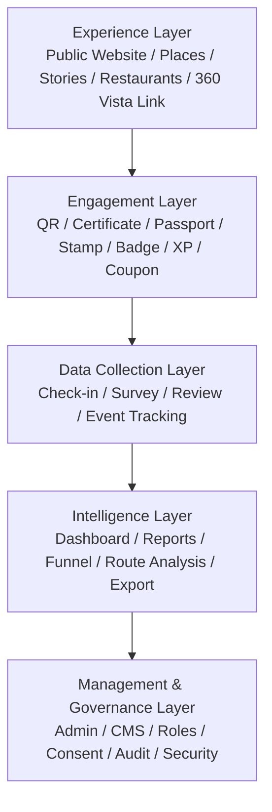
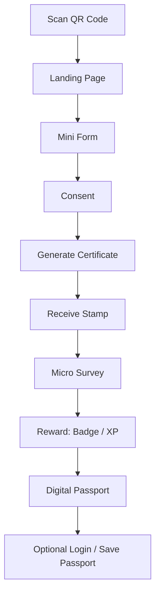
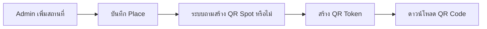
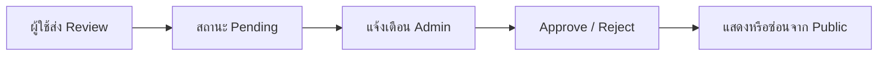
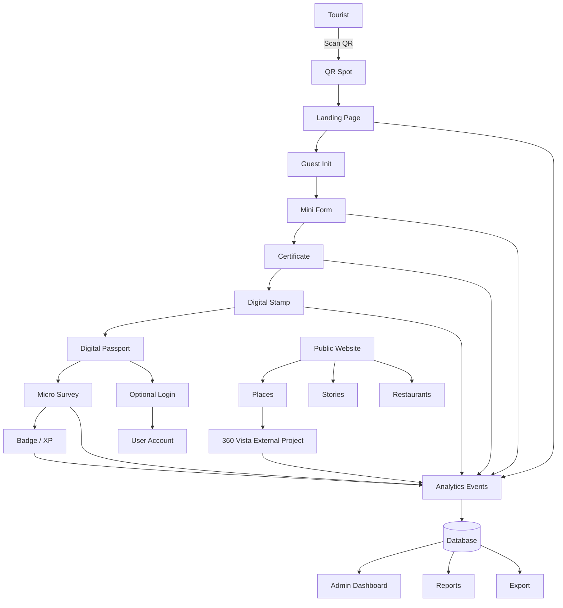
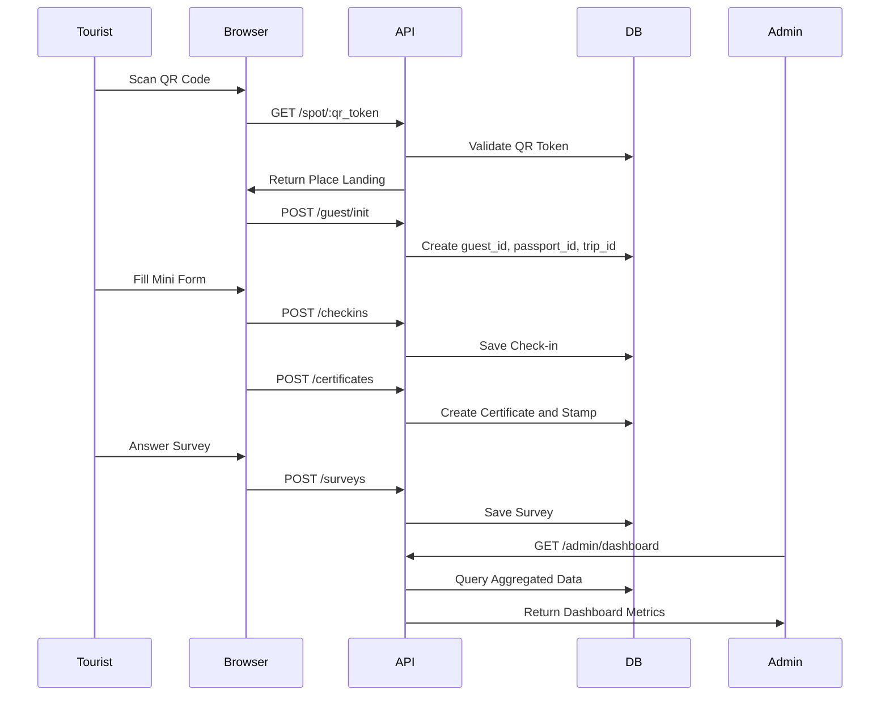

# เอกสารแนวคิดและข้อกำหนดระบบ  
# Smart Tourism Data & Digital Passport Platform  
## แพลตฟอร์มพาสปอร์ตดิจิทัลและฐานข้อมูลนักท่องเที่ยวชายแดนใต้

> เอกสารฉบับนี้จัดทำขึ้นเพื่อสรุป วิเคราะห์ และปรับโครงสร้างแนวคิดโปรเจกต์ให้เป็นเอกสาร Markdown สำหรับใช้วางแผน พัฒนา และส่งต่อให้ AI Agent Coding หรือทีมพัฒนาทำงานต่อได้อย่างเป็นระบบ

---

## 0. สรุปแนวคิดหลักของโปรเจกต์

โปรเจกต์นี้ไม่ควรถูกมองว่าเป็นเพียง “เว็บไซต์แนะนำสถานที่ท่องเที่ยว” หรือ “ระบบ QR Check-in” เท่านั้น แต่ควรวางตำแหน่งใหม่ให้เป็น:

> **Smart Tourism Data & Digital Passport Platform**  
> แพลตฟอร์มพาสปอร์ตดิจิทัลและฐานข้อมูลนักท่องเที่ยวชายแดนใต้ เพื่อเก็บ วิเคราะห์ และใช้ข้อมูลพฤติกรรมนักท่องเที่ยวในการวางแผนพัฒนาการท่องเที่ยวอย่างยั่งยืน

ระบบนี้รวม 3 แนวคิดใหญ่เข้าด้วยกัน:

1. **Tourism Experience**  
   นักท่องเที่ยวค้นหาสถานที่ อ่านเรื่องราว ดูร้านอาหาร ดูข้อมูลสถานที่ และเริ่มประสบการณ์การท่องเที่ยวผ่านเว็บไซต์หรือ PWA

2. **Digital Engagement**  
   นักท่องเที่ยวสแกน QR Code ตามสถานที่ รับ Digital Certificate, Digital Stamp และ Passport ใน MVP โดยระบบออกแบบให้ต่อยอด Badge, XP, Leaderboard และ Coupon ใน Release หลังเพื่อสร้างแรงจูงใจในการใช้งาน

3. **Tourism Intelligence**  
   หน่วยงานหรือผู้ดูแลระบบดู Dashboard, Reports, Funnel, Route Analysis, QR Analytics, Review Insight และ Export ข้อมูล เพื่อนำไปใช้วางแผนพัฒนาพื้นที่

แกนหลักที่ควรใช้สื่อสารกับอาจารย์หรือผู้เกี่ยวข้องคือ:

> **QR Check-in → Digital Passport → Reward → Tourism Data Dashboard**

---

## 1. ที่มาและปัญหา

พื้นที่ชายแดนใต้ ได้แก่ ยะลา ปัตตานี และนราธิวาส มีแหล่งท่องเที่ยวที่หลากหลาย ทั้งด้านธรรมชาติ วัฒนธรรม ศาสนา ประวัติศาสตร์ อาหาร และวิถีชีวิตชุมชน แต่ปัญหาที่พบคือ เมื่อมีนักท่องเที่ยวเดินทางเข้ามาในพื้นที่ หน่วยงานมักไม่สามารถเก็บข้อมูลเชิงพฤติกรรมได้อย่างต่อเนื่อง เช่น:

- นักท่องเที่ยวมาจากจังหวัดหรือประเทศใด
- นักท่องเที่ยวเป็นกลุ่มอายุใด
- นักท่องเที่ยวเดินทางมากับใคร
- ใช้ยานพาหนะประเภทใด
- ใช้จ่ายประมาณเท่าไร
- พึงพอใจกับสถานที่หรือบริการมากน้อยแค่ไหน
- หลังจากเที่ยวสถานที่หนึ่งแล้ว ไปที่ใดต่อ
- สถานที่ใดเป็นจุดเริ่มต้นยอดนิยม
- เส้นทางท่องเที่ยวใดเกิดขึ้นจริงจากพฤติกรรมนักท่องเที่ยว
- ร้านอาหารหรือชุมชนใดได้รับผลกระทบเชิงบวกจากการท่องเที่ยว

ระบบเดิมที่ใช้แบบสอบถามกระดาษหรือ Google Form มักไม่ประสบความสำเร็จ เพราะนักท่องเที่ยวไม่มีแรงจูงใจในการหยุดกรอกข้อมูลระหว่างท่องเที่ยว ดังนั้นโปรเจกต์นี้จึงใช้แนวคิด:

> **Reward-First Data Collection**  
> ให้ประสบการณ์หรือรางวัลแก่นักท่องเที่ยวก่อน แล้วค่อยเก็บข้อมูลที่จำเป็นภายหลังอย่างสมัครใจ

ตัวอย่างเช่น นักท่องเที่ยวสแกน QR Code ที่สถานที่ท่องเที่ยว → สร้างใบประกาศดิจิทัล → ได้รับ Stamp → ตอบแบบสำรวจสั้น ๆ → ข้อมูลถูกส่งเข้าสู่ Dashboard เพื่อวิเคราะห์

---

## 2. วัตถุประสงค์ของระบบ

### 2.1 วัตถุประสงค์หลัก

1. สร้างระบบเก็บข้อมูลนักท่องเที่ยวที่นักท่องเที่ยวเต็มใจให้ข้อมูลด้วยตนเอง
2. พัฒนา Digital Passport สำหรับสะสมตราประทับดิจิทัลจากสถานที่ท่องเที่ยว
3. พัฒนา Public Tourism Experience Portal สำหรับประชาสัมพันธ์สถานที่ เรื่องราว ร้านอาหาร และเส้นทางท่องเที่ยว
4. พัฒนาระบบ QR Code Check-in สำหรับเก็บข้อมูลการมาเยือนสถานที่จริง
5. พัฒนาระบบ Digital Certificate และ Reward เพื่อสร้างแรงจูงใจ
6. พัฒนา Dashboard สำหรับวิเคราะห์ข้อมูลพฤติกรรมนักท่องเที่ยว
7. พัฒนาระบบ Admin CMS สำหรับจัดการข้อมูลทั้งหมดแบบ Dynamic
8. รองรับการใช้งานหลายภาษา ได้แก่ ไทย อังกฤษ และมาเลย์
9. รองรับการเชื่อมต่อกับโปรเจกต์อื่น เช่น 360 Vista ซึ่งเป็นระบบภายนอก
10. วางโครงสร้างให้สามารถต่อยอดเป็นแพลตฟอร์มระดับพื้นที่ได้ในอนาคต

### 2.2 วัตถุประสงค์ด้านข้อมูล

ระบบต้องสามารถเก็บและวิเคราะห์ข้อมูลต่อไปนี้ได้:

- จำนวนการสแกน QR Code
- จำนวนการเช็คอินแต่ละสถานที่
- อัตราการสร้าง Certificate
- อัตราการตอบ Survey
- พฤติกรรมการเดินทางระหว่างสถานที่
- สถานที่ยอดนิยม
- เส้นทางยอดนิยม
- กลุ่มนักท่องเที่ยวหลัก
- ความพึงพอใจของนักท่องเที่ยว
- Engagement จาก Stories, Restaurants และ 360 Vista
- ข้อมูลเศรษฐกิจชุมชนจากการสนใจร้านอาหาร

---

## 3. นิยามโปรเจกต์ที่แนะนำ

### 3.1 ชื่อภาษาไทยที่แนะนำ

**ระบบพาสปอร์ตดิจิทัลและฐานข้อมูลนักท่องเที่ยวชายแดนใต้เพื่อสนับสนุนการวางแผนพัฒนาการท่องเที่ยวอย่างยั่งยืน**

### 3.2 ชื่อภาษาอังกฤษที่แนะนำ

**Smart Tourism Data & Digital Passport Platform for Southern Border Provinces**

### 3.3 คำอธิบายสั้น

ระบบนี้เป็นแพลตฟอร์มที่ผสานเว็บไซต์ประชาสัมพันธ์การท่องเที่ยว ระบบเช็คอินด้วย QR Code ระบบพาสปอร์ตดิจิทัล ระบบรางวัล และ Dashboard วิเคราะห์ข้อมูล เพื่อให้นักท่องเที่ยวได้รับประสบการณ์ที่สนุก พร้อมกับทำให้หน่วยงานสามารถนำข้อมูลจริงไปใช้วางแผนพัฒนาการท่องเที่ยวได้

### 3.4 คำอธิบายแบบนำเสนออาจารย์

โครงการนี้พัฒนาแพลตฟอร์ม Smart Tourism Data & Digital Passport สำหรับพื้นที่ชายแดนใต้ โดยใช้ QR Code เป็นจุดเริ่มต้นในการเช็คอินสถานที่ท่องเที่ยว นักท่องเที่ยวจะได้รับ Digital Certificate, Stamp, Badge และ XP เป็นแรงจูงใจในการใช้งาน จากนั้นระบบจะเก็บข้อมูลเชิงพฤติกรรมแบบไม่ระบุตัวตน เช่น จำนวนการมาเยือน เส้นทางการเดินทาง ความพึงพอใจ และการตอบแบบสำรวจ เพื่อนำข้อมูลไปแสดงผลบน Tourism Intelligence Dashboard สำหรับใช้วางแผนพัฒนาการท่องเที่ยวในพื้นที่

---

## 4. หลักการออกแบบระบบ

### 4.1 Reward-First Data Collection

ระบบต้องไม่เริ่มจากการบังคับกรอกแบบสอบถาม แต่ต้องเริ่มจากประสบการณ์ที่นักท่องเที่ยวอยากทำ เช่น:

- สแกน QR เพื่อรับ Certificate
- สะสม Stamp
- ปลดล็อก Badge
- เพิ่ม XP
- ดู Passport ของตนเอง
- แชร์ Certificate ลง Social

หลังจากนักท่องเที่ยวได้รับประสบการณ์หรือรางวัลแล้ว จึงค่อยเชิญชวนให้ตอบ Survey แบบสั้นและสมัครใจ

### 4.2 Guest-First Experience

นักท่องเที่ยวต้องใช้งานได้ทันทีโดยไม่ต้องสมัครสมาชิกตั้งแต่แรก

ระบบควรใช้หลักการ:

> **Guest ก่อน Login ทีหลัง**

กล่าวคือ:

1. สแกน QR ได้ทันที
2. ระบบสร้าง Anonymous Guest ID และ Digital Passport ID ให้อัตโนมัติ
3. ผู้ใช้สะสม Stamp ได้โดยไม่ต้อง Login
4. เมื่อต้องการบันทึกข้ามอุปกรณ์ ค่อย Login ด้วย Google, LINE หรือ Email
5. ระบบ Merge ข้อมูล Guest เข้ากับ User Account ภายหลัง

### 4.3 Data Minimization

ระบบต้องเก็บเฉพาะข้อมูลที่จำเป็นต่อการวิเคราะห์ ไม่ควรเก็บข้อมูลที่ระบุตัวตนโดยตรง เช่น เลขบัตรประชาชน ที่อยู่เต็ม หรือเบอร์โทร เว้นแต่มีเหตุผลและผู้ใช้ยินยอมอย่างชัดเจน

### 4.4 Privacy by Design

ตั้งแต่การออกแบบฐานข้อมูล ต้องแยกข้อมูลส่วนบุคคลออกจากข้อมูลพฤติกรรม เช่น:

- ตารางพฤติกรรมใช้ `guest_id`, `passport_id`, `trip_id`
- ตารางข้อมูลบัญชีจริงใช้ `user_id`
- ตารางเชื่อมบัญชีใช้ `identity_links`
- ข้อมูลสำหรับ Dashboard ควรเป็นข้อมูลรวม ไม่ใช่ข้อมูลรายบุคคลที่ระบุตัวจริงได้

### 4.5 Integration-Ready Architecture

ระบบต้องรองรับการเชื่อมต่อกับโปรเจกต์อื่น เช่น 360 Vista หรือระบบของกลุ่มอื่นในอนาคต โดยไม่ทำให้ระบบของเราผูกติดกับระบบภายนอกมากเกินไป

---

## 5. ขอบเขตระบบโดยรวม

โปรเจกต์นี้จะทำทุกส่วน แต่แบ่งออกเป็นกลุ่มงานเพื่อให้วางแผนและพัฒนาได้เป็นระบบ ไม่ใช่การตัดฟีเจอร์ออก

### 5.1 ส่วนที่ระบบของเรารับผิดชอบหลัก

1. Public Tourism Experience Portal
2. Tourist PWA Flow
3. QR Code Check-in System
4. Anonymous Guest Identification
5. Digital Passport
6. Digital Certificate
7. Digital Stamp
8. Badge & XP System
9. Leaderboard
10. Coupon System
11. Micro Survey และ Deep Survey
12. Stories Module
13. Restaurants / Local Economy Module
14. Reviews System
15. Admin CMS
16. Tourism Intelligence Dashboard
17. Reports & Export
18. User Management / Role Permission
19. Audit Log
20. Event Tracking / Analytics
21. Privacy & Consent Management
22. External Integration Gateway

### 5.2 ส่วนที่เป็นระบบภายนอก แต่เชื่อมโยงกับเรา

#### 360 Vista

360 Vista เป็นโปรเจกต์ของอีกกลุ่มหนึ่ง ไม่ใช่โมดูลที่เราพัฒนาเองทั้งหมด แต่ระบบของเราจะเชื่อมโยงด้วยวิธีต่อไปนี้:

- เก็บ `external_url` หรือ `embed_url` ของ 360 Vista ในข้อมูลสถานที่
- แสดงปุ่มหรือ preview บนหน้า Place Detail
- บันทึก event เมื่อผู้ใช้กดดู 360 Vista
- เชื่อม `place_id` ของเรากับรหัสสถานที่ของระบบ 360 Vista
- หากระบบ 360 Vista มี API หรือ Embed ในอนาคต จึงค่อยเชื่อมต่อเพิ่ม

ระบบของเราไม่ควรเก็บไฟล์ 360 เอง และไม่ควรส่ง `guest_id` จริงไปยังระบบภายนอกโดยตรง

---

## 6. โครงสร้างแพลตฟอร์มแบบ 5 Layers

เพื่อให้ระบบใหญ่แต่ไม่กระจัดกระจาย ควรวางโครงสร้างเป็น 5 ชั้นดังนี้



### 6.1 Experience Layer

เป็นส่วนที่นักท่องเที่ยวเห็นและใช้งาน เช่น:

- Home
- About
- Places
- Place Detail
- Stories
- Story Detail
- Restaurants
- Restaurant Detail
- Reviews
- Interactive Map
- 360 Vista Link / Embed
- Contact

### 6.2 Engagement Layer

เป็นส่วนที่ทำให้นักท่องเที่ยวอยากใช้งานต่อ เช่น:

- QR Code Check-in
- Digital Certificate
- Digital Stamp
- Digital Passport
- Badge
- XP
- Level
- Leaderboard
- Coupon
- Share Certificate

### 6.3 Data Collection Layer

เป็นส่วนที่เก็บข้อมูลจากพฤติกรรมจริง เช่น:

- QR Scan
- Landing View
- Form Start
- Certificate Created
- Certificate Shared
- Survey Completed
- Review Submitted
- Restaurant Viewed
- Story Read
- 360 Vista Opened
- Route Followed

### 6.4 Intelligence Layer

เป็นส่วนที่นำข้อมูลมาวิเคราะห์ เช่น:

- Overview Dashboard
- Place Performance Dashboard
- QR Analytics
- Funnel Analysis
- Route Analysis
- Tourist Behavior Analysis
- Review Insight
- Local Economy Insight
- Export CSV / Excel / PDF

### 6.5 Management & Governance Layer

เป็นส่วนควบคุมระบบ เช่น:

- Admin Panel
- CMS
- Role & Permission
- Consent Management
- Audit Log
- Data Export Control
- Security
- PDPA Request
- External Integration Setting

---

## 7. กลุ่มผู้ใช้งาน

### 7.1 นักท่องเที่ยวคนไทย

ลักษณะ:

- มาจากจังหวัดอื่นในภาคใต้
- มาจากกรุงเทพฯ หรือต่างจังหวัด
- ใช้ภาษาไทยเป็นหลัก
- มีโอกาสใช้ LINE สูง
- ต้องการประสบการณ์ที่ง่าย ไม่ยุ่งยาก

สิ่งที่ระบบต้องรองรับ:

- ภาษาไทย
- Login ด้วย LINE แบบ optional
- แชร์ Certificate ผ่าน LINE / Facebook
- ใช้งานผ่านมือถือโดยไม่ต้องติดตั้งแอป

### 7.2 นักท่องเที่ยวต่างชาติ

ลักษณะ:

- มาจากมาเลเซีย อินโดนีเซีย สิงคโปร์ หรือประเทศอื่น
- อาจไม่ใช้ LINE
- ต้องการภาษาอังกฤษหรือมาเลย์
- ต้องการข้อมูลสถานที่ชัดเจนและเข้าใจง่าย

สิ่งที่ระบบต้องรองรับ:

- ภาษาอังกฤษและมาเลย์
- Login ด้วย Google แบบ optional
- UI ที่เข้าใจง่าย
- ไม่พึ่งพาข้อมูลเฉพาะคนไทย เช่น จังหวัดไทยเพียงอย่างเดียว

### 7.3 Admin / เจ้าหน้าที่ / หน่วยงาน

แบ่งเป็นระดับ:

| Role | หน้าที่หลัก |
|---|---|
| Super Admin | ควบคุมทั้งระบบ จัดการผู้ใช้ สิทธิ์ ข้อมูล และ Audit Log |
| Content Manager | จัดการสถานที่ บทความ ร้านอาหาร รูปภาพ รีวิว |
| Data Analyst | ดู Dashboard วิเคราะห์ข้อมูล Export รายงาน |
| Viewer | ดู Dashboard และรายงานบางส่วนเท่านั้น |

### 7.4 ร้านค้า / ร้านอาหาร / ชุมชน

ในอนาคตอาจมีบทบาทเป็น Partner Account ได้ เช่น:

- แก้ไขข้อมูลร้านของตนเอง
- ดูสถิติการเข้าชมร้าน
- สร้าง Coupon
- ดูจำนวนการกดนำทางไปยังร้าน

---

## 8. Module A — Public Tourism Experience Portal

Public Website ไม่ควรถูกออกแบบเป็นเว็บโชว์ข้อมูลธรรมดา แต่ควรเป็น “ประตูเข้าสู่ประสบการณ์ท่องเที่ยว” และเป็นช่องทางนำผู้ใช้เข้าสู่ Digital Passport

### 8.1 หน้า Home `/`

หน้าหลักของเว็บไซต์ ควรมี:

- Hero Section
- Tagline ของโครงการ
- Featured Places 3 จังหวัด
- Latest Stories
- Featured Restaurants
- Quick Stats
- ปุ่มเริ่มสะสม Passport
- ปุ่มค้นหาสถานที่
- ปุ่มดูแผนที่ท่องเที่ยว

ตัวอย่าง Quick Stats:

- จำนวนสถานที่ในระบบ
- จำนวน Check-in ทั้งหมด
- จำนวน Digital Passport ที่ถูกสร้าง
- สถานที่ยอดนิยมประจำเดือน

### 8.2 หน้า About `/about`

ควรอธิบาย:

- ที่มาและปัญหา
- วัตถุประสงค์
- วิธีการทำงานของระบบ
- ประโยชน์ต่อนักท่องเที่ยว
- ประโยชน์ต่อหน่วยงาน
- ประโยชน์ต่อชุมชน
- ข้อมูลทีมพัฒนาและพันธมิตร

### 8.3 หน้า Places `/places`

ควรมี:

- Search สถานที่
- Filter ตามจังหวัด
- Filter ตามประเภท เช่น ธรรมชาติ วัฒนธรรม อาหาร ประวัติศาสตร์ ศาสนา
- Filter ตาม Rating
- Interactive Map
- Card Grid
- ปุ่มดูรายละเอียด
- ปุ่มเริ่มสะสม Passport

ข้อมูลบน Card ควรมี:

- รูปสถานที่
- ชื่อสถานที่
- จังหวัด
- ประเภท
- Rating
- จำนวน Check-in
- Badge หรือ Stamp ที่จะได้รับ

### 8.4 หน้า Place Detail `/places/[id]`

ควรเป็นหน้าที่รวมทุกมิติของสถานที่ ไม่ใช่แค่รายละเอียดทั่วไป

ควรมี:

- Gallery รูปภาพ
- ประวัติและคำอธิบาย
- แผนที่ตำแหน่ง
- ปุ่มนำทาง
- ปุ่มดู 360 Vista
- Public Reviews ที่ผ่านการอนุมัติแล้ว
- Rating โดยรวม
- สถานที่ใกล้เคียง
- ร้านอาหารใกล้เคียง
- Stories ที่เกี่ยวข้อง
- Stamp / Badge ที่เกี่ยวข้อง
- QR Spots ของสถานที่นี้สำหรับ Admin เท่านั้น

### 8.5 หน้า Stories `/stories`

Stories ไม่ควรเป็นบทความทั่วไป แต่ควรเป็น Content-to-Travel Funnel

เป้าหมายคือ:

> อ่านบทความ → สนใจสถานที่ → กดดู Place → เดินทางจริง → สแกน QR → ระบบรู้ว่าบทความช่วยกระตุ้นการท่องเที่ยวได้

ควรมี:

- รายการบทความ
- Filter ตามหมวดหมู่
- Search
- Featured Story
- บทความที่เกี่ยวกับจังหวัด
- บทความที่เกี่ยวกับเส้นทาง
- ปุ่มดูสถานที่ที่เกี่ยวข้อง

### 8.6 หน้า Story Detail `/stories/[id]`

ควรมี:

- เนื้อหา Rich Text
- รูปภาพประกอบ
- สถานที่ที่เกี่ยวข้อง
- ร้านอาหารที่เกี่ยวข้อง
- เส้นทางแนะนำ
- ปุ่มบันทึกเส้นทาง
- ปุ่มเริ่มสะสม Passport

ระบบควรเก็บ event:

- `story_viewed`
- `story_read_duration`
- `story_place_click`
- `story_route_saved`
- `story_to_checkin_conversion`

### 8.7 หน้า Restaurants `/restaurants`

Restaurants ควรถูกนิยามเป็น Local Economy Module ไม่ใช่แค่รายชื่อร้านอาหาร

ควรมี:

- Search ร้านอาหาร
- Filter ตามจังหวัด
- Filter ตามประเภทอาหาร
- Filter ตามระยะทางจากสถานที่ท่องเที่ยว
- แผนที่ร้านอาหาร
- Rating และ Review
- ปุ่มนำทาง
- ปุ่มดูเมนู

ระบบควรวิเคราะห์ได้ว่า:

- ร้านใดถูกดูมากที่สุด
- ร้านใดมีคนกดนำทางมากที่สุด
- สถานที่ท่องเที่ยวใดส่ง traffic ไปยังร้านอาหารใด
- ประเภทอาหารใดได้รับความนิยมจากนักท่องเที่ยว

### 8.8 หน้า Restaurant Detail `/restaurants/[id]`

ควรมี:

- รูปภาพร้าน
- เมนูแนะนำ
- ประเภทอาหาร
- เวลาทำการ
- ที่ตั้ง
- แผนที่
- ปุ่มนำทาง
- Reviews
- สถานที่ท่องเที่ยวใกล้เคียง
- Coupon ที่ใช้ได้

### 8.9 หน้า 360 Vista `/360-vista`

หน้า 360 Vista ควรระบุชัดว่าเป็นระบบภายนอกหรือโปรเจกต์ของอีกทีมหนึ่ง

หน้าที่ของระบบเรา:

- แสดงรายการสถานที่ที่มี 360 Vista
- ลิงก์ไปยังระบบภายนอก
- แสดง Preview ถ้าระบบภายนอกรองรับ Embed
- เก็บ event เมื่อผู้ใช้กดเปิด

Event ที่ควรเก็บ:

- `vista_opened`
- `vista_opened_from_place_detail`
- `vista_opened_from_story`
- `vista_returned_to_platform`

### 8.10 หน้า Contact `/contact`

ควรมี:

- Contact Form
- ข้อมูลติดต่อโครงการ
- FAQ
- ช่องทางเสนอแนะ
- ช่องทางสมัครเป็นสถานที่หรือร้านค้าที่เข้าร่วมโครงการ

---

## 9. Module B — Tourist Flow / PWA

Tourist Flow เป็นหัวใจของระบบ เพราะเป็นจุดที่นักท่องเที่ยวสร้างข้อมูลให้ระบบผ่านประสบการณ์จริง

### 9.1 ภาพรวม Tourist Journey



### 9.2 Step 1 — QR Scan

นักท่องเที่ยวสแกน QR Code ที่ติดตามสถานที่ท่องเที่ยว จุดถ่ายรูป ร้านค้า หรือจุดกิจกรรม

ระบบต้องรู้ทันทีว่า:

- QR นี้เป็นของสถานที่ใด
- QR นี้เป็นจุดใดในสถานที่
- QR นี้ยังใช้งานอยู่หรือไม่
- QR นี้อยู่ในแคมเปญใด
- QR นี้ควรให้ Stamp หรือ Certificate แบบใด

Event:

- `qr_scan`

### 9.3 Step 2 — Landing Page `/spot/[qr_token]`

หลังจากสแกน QR ผู้ใช้เข้าสู่ Landing Page เฉพาะจุดนั้น

ควรมี:

- ชื่อสถานที่
- รูปภาพสวยงาม
- ประวัติสั้น ๆ
- Preview Certificate
- Stamp ที่จะได้รับ
- ปุ่ม “สร้างใบประกาศของฉัน”
- Language Switcher TH / EN / MS

Event:

- `landing_view`

### 9.4 Step 3 — Mini Form `/create/[qr_token]`

Mini Form ควรสั้น ใช้เวลาไม่เกิน 1-2 นาที

#### Step 3.1 ข้อมูลพื้นฐาน

เก็บเฉพาะข้อมูลที่จำเป็น:

- ชื่อที่ต้องการแสดงบนใบประกาศ
- มาจากจังหวัดหรือประเทศใด
- ช่วงอายุ
- สัญชาติ
- ภาษา

ข้อสำคัญ:

> ชื่อที่แสดงบนใบประกาศไม่จำเป็นต้องเป็นชื่อจริง สามารถใช้ชื่อเล่นหรือนามแฝงได้

#### Step 3.2 รูปภาพ

ผู้ใช้สามารถ:

- อัปโหลดรูป
- ถ่ายรูปจากกล้อง
- ข้ามการอัปโหลดรูป
- ใช้ Avatar แทน

ข้อแนะนำ:

- ไม่บังคับใช้รูปจริง
- ต้องแสดงข้อความว่า “สามารถข้ามได้”
- หากมีการใช้รูป ต้องมี Consent
- รูปควรใช้สำหรับสร้าง Certificate เท่านั้น

#### Step 3.3 Consent

ก่อนสร้าง Certificate ควรมี Consent ภาษาง่าย

ตัวอย่าง:

> ระบบจะใช้ข้อมูลของคุณเพื่อสร้างใบประกาศดิจิทัลและวิเคราะห์ข้อมูลการท่องเที่ยวในภาพรวม โดยไม่เปิดเผยตัวตนจริงของคุณ

Consent ควรแยกเป็น 3 ระดับ:

| Consent | จำเป็น | ใช้เพื่อ |
|---|---|---|
| Basic Usage Consent | จำเป็น | สร้าง Certificate, Stamp, Passport |
| Research Consent | สมัครใจ | ใช้ข้อมูลไม่ระบุตัวตนเพื่อวิเคราะห์ |
| Marketing / Share Consent | สมัครใจ | ใช้รูปหรือ Certificate เพื่อเผยแพร่ |

Event:

- `form_start`
- `form_step_1_done`
- `photo_uploaded`
- `photo_skipped`
- `consent_accepted`
- `cert_created`

### 9.5 Step 4 — Certificate Page `/certificate/[id]`

หลังจากสร้าง Certificate ระบบแสดงใบประกาศดิจิทัล

ควรมี:

- Animation แสดงผลสำเร็จ
- ชื่อผู้ใช้หรือนามแฝง
- รูปหรือ Avatar
- ชื่อสถานที่
- วันที่
- ตราโครงการ
- ปุ่ม Download
- ปุ่ม Share
- ปุ่ม Copy Link
- Stamp ที่ได้รับ
- Progress ของ Passport

Event:

- `cert_viewed`
- `cert_downloaded`
- `cert_shared_line`
- `cert_shared_facebook`
- `cert_copy_link`

### 9.6 Step 5 — Micro Survey

หลังผู้ใช้ได้รับ Certificate แล้ว จึงค่อยเชิญชวนตอบแบบสำรวจสั้น

ข้อความควรเป็นมิตร:

> ช่วยตอบ 4 ข้อสั้น ๆ ได้ไหม? ใช้เวลาไม่ถึง 1 นาที ข้อมูลของคุณจะช่วยพัฒนาการท่องเที่ยวในพื้นที่

คำถามที่แนะนำ:

1. เดินทางมากับใคร
2. เดินทางด้วยอะไร
3. ใช้จ่ายประมาณเท่าไร
4. ความพึงพอใจต่อสถานที่
5. ข้อเสนอแนะเพิ่มเติม optional

ต้องมีปุ่ม Skip ชัดเจน

Event:

- `survey_started`
- `survey_completed`
- `survey_skipped`

### 9.7 Step 6 — Reward หลัง Survey

ถ้าผู้ใช้ตอบ Survey ควรได้รับ Reward เพิ่ม เช่น:

- XP เพิ่ม
- Badge พิเศษ
- Progress ไปยัง Level ถัดไป
- ข้อความขอบคุณ

Event:

- `xp_earned`
- `badge_unlocked`

### 9.8 Step 7 — Digital Passport

หลังจากได้รับ Stamp ควรพาผู้ใช้ไปหน้า Passport

Passport ควรแสดง:

- Stamp ที่ได้รับแล้ว
- Stamp ที่ยังไม่ได้
- สถานที่ที่แนะนำถัดไป
- Badge ที่ปลดล็อกแล้ว
- Badge ที่ใกล้ปลดล็อก
- XP และ Level
- ปุ่มบันทึก Passport ข้ามอุปกรณ์

### 9.9 Step 8 — Optional Login

ผู้ใช้ไม่ควรถูกบังคับ Login ตั้งแต่แรก แต่ควรถูกเชิญชวนหลังมีคุณค่าแล้ว

ข้อความแนะนำ:

> ต้องการบันทึก Passport ของคุณไว้ใช้งานครั้งต่อไปหรือไม่?

ตัวเลือก:

- Login ด้วย Google
- Login ด้วย LINE
- Login ด้วย Email
- ข้ามได้

เมื่อ Login แล้ว ระบบต้อง Merge ข้อมูล Guest เดิมเข้ากับ User Account

---

## 10. ระบบระบุตัวตนแบบ Guest / Anonymous Tourist Identification

### 10.1 หลักการสำคัญ

ในระดับ Guest ระบบไม่สามารถรู้ได้ 100% ว่าเป็นบุคคลคนเดิมจริง ๆ เพราะผู้ใช้ไม่ได้ Login และไม่ได้ให้ข้อมูลระบุตัวตนจริง

แต่ระบบสามารถรู้ได้ว่าเป็น:

> **ผู้ใช้นิรนามรายเดิมจากอุปกรณ์หรือ Digital Passport เดิม**

โดยใช้รหัสแบบไม่ระบุตัวตน เช่น:

- `guest_id`
- `passport_id`
- `trip_id`

### 10.2 ID หลักที่ควรมี

| ID | ความหมาย | ใช้ทำอะไร |
|---|---|---|
| `guest_id` | ผู้ใช้นิรนาม | จำว่าเป็น visitor เดิมใน browser/device เดิม |
| `passport_id` | สมุด Passport ดิจิทัล | เก็บ Stamp, Badge, XP |
| `trip_id` | การเดินทางหนึ่งรอบ | วิเคราะห์เส้นทางในทริปนั้น |
| `user_id` | บัญชีจริงเมื่อ Login | ใช้บันทึกข้ามอุปกรณ์ |

### 10.3 วิธีทำงานครั้งแรก

เมื่อผู้ใช้สแกน QR ครั้งแรก:

1. ระบบตรวจว่ามี `guest_id` อยู่ใน browser หรือไม่
2. ถ้าไม่มี ระบบสร้าง `guest_id` ใหม่
3. สร้าง `passport_id` ใหม่
4. สร้าง `trip_id` ใหม่
5. เก็บค่าไว้ใน Cookie / localStorage / IndexedDB
6. บันทึก event `qr_scan`

ตัวอย่าง:

```text
guest_id = gst_8f92a1
passport_id = pass_72b91c
trip_id = trip_20260523_001
```

### 10.4 วิธีรู้ว่าคนนี้เคยมาแล้ว

ระบบตรวจจากประวัติ `checkins` ของ `guest_id` หรือ `passport_id`

Logic:

```text
ถ้า guest_id ไม่เคยมี checkin มาก่อน
= นักท่องเที่ยวใหม่ในระบบ

ถ้า guest_id เคยมี checkin แล้ว
= นักท่องเที่ยวที่กลับมาใช้งานซ้ำ

ถ้า guest_id เคย checkin place_id นี้แล้ว
= เคยมาเยือนสถานที่นี้แล้ว

ถ้า guest_id ยังไม่เคย checkin place_id นี้
= มาเยือนสถานที่นี้ครั้งแรก
```

### 10.5 วิธีรู้ว่าไปที่อื่นต่อ

ระบบเรียง event ตามเวลาใน `trip_id` เดียวกัน

ตัวอย่าง:

```text
10:00 checkin place A
11:30 checkin place B
13:00 restaurant_view restaurant X
15:00 checkin place C
```

ระบบสรุปเส้นทางได้ว่า:

```text
Place A → Place B → Restaurant X → Place C
```

ถ้ามีผู้ใช้จำนวนมากมี sequence คล้ายกัน ระบบจะรู้ว่าเป็นเส้นทางยอดนิยม

### 10.6 การสร้าง Trip ใหม่

ระบบควรกำหนดกติกา เช่น:

- ถ้าไม่มี activity เกิน 24 ชั่วโมง ให้สร้าง `trip_id` ใหม่
- หรือถ้าผู้ใช้กด “เริ่มทริปใหม่” ให้สร้าง `trip_id` ใหม่
- หรือถ้าเดินทางข้ามวัน ให้แยกเป็น trip ใหม่เพื่อวิเคราะห์ง่ายขึ้น

### 10.7 ข้อจำกัดของ Guest Mode

| สถานการณ์ | ระบบจำได้หรือไม่ |
|---|---|
| ใช้มือถือเครื่องเดิม browser เดิม | จำได้ |
| ปิดเว็บแล้วกลับมาใหม่ | จำได้ ถ้า token ยังอยู่ |
| ใช้โหมดไม่ระบุตัวตน | อาจจำไม่ได้ |
| ล้าง cookie/cache | จำไม่ได้ |
| เปลี่ยนมือถือ | จำไม่ได้ ถ้ายังไม่ Login |
| ใช้มือถือร่วมกันหลายคน | อาจนับเป็นคนเดียวกันผิด |
| Login ภายหลัง | จำได้แม่นขึ้นและใช้ข้ามอุปกรณ์ได้ |

### 10.8 Guest Merge เมื่อ Login

เมื่อผู้ใช้ Login ภายหลัง:

```text
guest_id gst_8f92a1
เชื่อมกับ
user_id usr_155
```

ระบบต้อง:

1. สร้าง record ใน `identity_links`
2. ย้ายหรือเชื่อม Passport เดิมกับ `user_id`
3. ไม่ลบข้อมูล Guest เดิม
4. ป้องกันการ merge ซ้ำผิดบัญชี
5. ให้ผู้ใช้ยืนยันก่อนเชื่อมข้อมูล

### 10.9 ประโยคที่ควรใช้ในเอกสาร

> ระบบจะสร้าง Anonymous Guest ID และ Digital Passport ID ให้กับนักท่องเที่ยวเมื่อมีการสแกน QR Code ครั้งแรก เพื่อใช้ติดตามพฤติกรรมการเช็คอิน การสะสมตราประทับดิจิทัล เส้นทางการเดินทาง และการกลับมาใช้งานซ้ำ โดยไม่จำเป็นต้องเก็บข้อมูลส่วนบุคคลที่สามารถระบุตัวตนได้โดยตรง ทั้งนี้ผู้ใช้สามารถเชื่อมบัญชีภายหลังเพื่อบันทึก Passport ข้ามอุปกรณ์ได้

---

## 11. Module C — Digital Engagement & Reward System

### 11.1 Digital Certificate

Digital Certificate คือรางวัลแรกที่ทำให้นักท่องเที่ยวอยากใช้งาน

ควรมี:

- Template ตามสถานที่หรือจังหวัด
- ชื่อแสดงผลของผู้ใช้
- รูปหรือ Avatar
- ชื่อสถานที่
- วันที่
- QR หรือรหัสอ้างอิง Certificate
- ปุ่ม Download
- ปุ่ม Share

### 11.2 Digital Stamp

Stamp คือหลักฐานการเช็คอิน

กติกา:

- 1 สถานที่ให้ Stamp 1 แบบ
- QR หลายจุดในสถานที่เดียวกันอาจให้ Stamp เดียวกัน หรือแยกเป็น Sub-stamp ได้
- ป้องกันการรับ Stamp ซ้ำด้วย guest_id/passport_id/place_id

### 11.3 Digital Passport

Passport คือศูนย์กลางประสบการณ์ของผู้ใช้

ควรมี:

- Stamp Collection
- Badge Collection
- XP / Level
- Progress รายจังหวัด
- สถานที่แนะนำถัดไป
- ประวัติ Certificate
- ปุ่ม Save Passport

### 11.4 Badge

ตัวอย่าง Badge:

| Badge | เงื่อนไข |
|---|---|
| Welcome Explorer | เช็คอินครั้งแรก |
| Yala Explorer | เช็คอินครบตามเงื่อนไขในยะลา |
| Pattani Explorer | เช็คอินครบตามเงื่อนไขในปัตตานี |
| Narathiwat Explorer | เช็คอินครบตามเงื่อนไขในนราธิวาส |
| Border South Explorer | เช็คอินครบทั้ง 3 จังหวัด |
| Tourism Contributor | ตอบ Survey ครบ 5 ครั้ง |
| Local Food Supporter | กดดูร้านอาหารหรือใช้ Coupon |
| Route Finisher | เที่ยวครบตาม Suggested Route |
| Ambassador | แชร์ Certificate หลายครั้ง |

### 11.5 XP และ Level

ตัวอย่างกติกา XP:

| พฤติกรรม | XP |
|---|---:|
| เช็คอินสถานที่ | +10 |
| สร้าง Certificate | +5 |
| ตอบ Survey | +20 |
| แชร์ Certificate | +5 |
| เขียน Review ที่ผ่านการอนุมัติ | +15 |
| เที่ยวครบ Route | +30 |
| ใช้ Coupon | +10 |

ตัวอย่าง Level:

| Level | XP ขั้นต่ำ |
|---|---:|
| Level 1 Visitor | 0 |
| Level 2 Explorer | 50 |
| Level 3 Adventurer | 150 |
| Level 4 Ambassador | 300 |

### 11.6 Leaderboard

Leaderboard ควรมี แต่ต้องออกแบบให้ไม่กระทบความเป็นส่วนตัว

แนวทางที่แนะนำ:

- ใช้นามแฝง ไม่ใช้ชื่อจริง
- ให้ผู้ใช้เลือกว่าจะเข้าร่วม Leaderboard หรือไม่
- แสดงเฉพาะ display name
- ไม่แสดงข้อมูลส่วนตัว
- แยก Leaderboard ตามจังหวัดหรือช่วงเวลา

### 11.7 Coupon System

Coupon System ใช้เชื่อมการท่องเที่ยวกับร้านค้าและชุมชน

ตัวอย่าง:

- เช็คอินครบ 3 จุด รับส่วนลดร้านอาหาร
- ตอบ Survey รับ Coupon
- ใช้ Passport แสดงสิทธิ์ที่ร้านค้า

ระบบต้องมี:

- Coupon Code
- Redemption Code
- วันหมดอายุ
- ร้านค้าที่ใช้ได้
- จำนวนสิทธิ์
- สถานะใช้แล้วหรือยัง

---

## 12. Module D — Data Collection & Event Tracking

### 12.1 Data Source Map

| แหล่งข้อมูล | ข้อมูลที่เก็บ | ใช้ประโยชน์ |
|---|---|---|
| QR Scan | เวลา, สถานที่, จุด QR | วัดความสนใจของจุดท่องเที่ยว |
| Landing Page | view, language, device | วิเคราะห์ความสนใจเบื้องต้น |
| Mini Form | ที่มา, ช่วงอายุ, สัญชาติ | วิเคราะห์กลุ่มนักท่องเที่ยว |
| Certificate | สร้าง, ดาวน์โหลด, แชร์ | วัด engagement |
| Passport | Stamp, Badge, XP | วิเคราะห์การกลับมาใช้งาน |
| Survey | กลุ่มเดินทาง, ค่าใช้จ่าย, คะแนน | ใช้วางแผนพัฒนาพื้นที่ |
| Review | ความคิดเห็นเชิงคุณภาพ | วิเคราะห์ปัญหาสถานที่ |
| Stories | อ่าน, คลิกต่อ, conversion | วิเคราะห์ content ที่พาคนไปเที่ยว |
| Restaurant | view, click, navigation | วิเคราะห์เศรษฐกิจชุมชน |
| 360 Vista | open, source, return | วิเคราะห์ความสนใจต่อสื่อเสมือนจริง |

### 12.2 Event Tracking Specification

Event สำคัญที่ควรเก็บ:

```text
qr_scan
landing_view
form_start
form_step_1_done
photo_uploaded
photo_skipped
consent_accepted
cert_created
cert_viewed
cert_downloaded
cert_shared
survey_started
survey_completed
survey_skipped
passport_viewed
passport_saved
login_started
login_completed
badge_unlocked
xp_earned
review_submitted
review_approved
story_viewed
story_place_click
restaurant_viewed
restaurant_direction_clicked
vista_opened
route_viewed
route_saved
route_completed
coupon_claimed
coupon_redeemed
export_created
```

### 12.3 Event Metadata

ทุก event ควรมีข้อมูลพื้นฐาน:

```json
{
  "event_name": "qr_scan",
  "guest_id": "gst_xxx",
  "passport_id": "pass_xxx",
  "trip_id": "trip_xxx",
  "user_id": null,
  "place_id": "place_xxx",
  "qr_spot_id": "qr_xxx",
  "language": "th",
  "device_type": "mobile",
  "created_at": "2026-05-23T10:00:00+07:00"
}
```

---

## 13. Module E — Admin Panel / CMS

### 13.1 Admin Layout

Admin Panel ควรมีเมนูหลัก:

- Dashboard
- Places
- QR Spots
- Stories
- Restaurants
- Reviews
- Certificates
- Rewards
- Surveys
- Reports
- Export
- Users
- Roles
- Audit Log
- Settings
- Integrations

### 13.2 Dashboard `/admin/dashboard`

ควรมี KPI Cards:

- Total Visitors
- Total Check-ins
- Certificates Created
- Survey Response Rate
- Average Satisfaction
- Top Place
- Active Passports
- Returning Visitors

Charts:

- Check-in by Date
- Check-in by Province
- QR Funnel
- Tourist Origin
- Satisfaction Trend
- Top Places
- Popular Routes
- Restaurant Engagement

### 13.3 Places Management

ฟีเจอร์:

- เพิ่มสถานที่
- แก้ไขสถานที่
- อัปโหลดรูป
- ตั้งจังหวัดและประเภท
- ตั้ง Location
- เชื่อม Stories
- เชื่อม Restaurants
- เชื่อม 360 Vista external URL
- ตั้ง Stamp / Badge
- สร้าง QR Spots ต่อทันที

### 13.4 QR Spots Management

ฟีเจอร์:

- สร้าง QR Spot
- ตั้งชื่อจุด
- ผูกกับ Place
- สร้าง QR Token
- ดาวน์โหลด QR Code
- เปิด/ปิด QR
- ดูสถิติ QR รายจุด

### 13.5 Reviews Management

Review มี 2 ประเภท:

1. **Public Review**  
   แสดงบนหน้า Place Detail หลังผ่านการอนุมัติ

2. **Internal Feedback**  
   ใช้สำหรับวิเคราะห์ปัญหา ไม่แสดงสาธารณะ

Admin ต้องสามารถ:

- Approve
- Reject
- Hide
- Mark as Issue
- Filter ตามสถานที่
- Filter ตามคะแนน
- ดูคำที่พบบ่อย

### 13.6 Stories Management

ฟีเจอร์:

- สร้างบทความ
- Rich Text Editor
- อัปโหลดรูป
- เลือกสถานที่ที่เกี่ยวข้อง
- เลือกร้านอาหารที่เกี่ยวข้อง
- ตั้ง SEO / Open Graph
- Publish / Draft
- ดูสถิติการอ่าน

### 13.7 Restaurants Management

ฟีเจอร์:

- เพิ่มร้านอาหาร
- ตั้งประเภทอาหาร
- ตั้งเวลาทำการ
- ตั้งพิกัด
- อัปโหลดรูปและเมนู
- เชื่อมกับสถานที่ใกล้เคียง
- สร้าง Coupon
- ดูสถิติการกดดูร้านและกดนำทาง

### 13.8 Reports & Export

ควร Export ได้:

- CSV
- Excel
- PDF Report

ข้อมูล Export ควรมีหลายระดับ:

- Summary Report
- Place Report
- QR Report
- Survey Report
- Review Report
- Route Report
- Restaurant Report

ข้อควรระวัง:

- Viewer ไม่ควร Export raw data
- Data Analyst Export ได้เฉพาะข้อมูลที่ไม่ระบุตัวตน
- Super Admin Export ได้มากกว่า แต่ต้องมี Audit Log

### 13.9 Audit Log

ควรบันทึกทุกการกระทำสำคัญของ Admin เช่น:

- Login
- เพิ่มสถานที่
- แก้ไขสถานที่
- ลบข้อมูล
- Approve Review
- Export Data
- เปลี่ยนสิทธิ์ผู้ใช้
- ปรับ Reward Rule
- แก้ Settings

---

## 14. Permission Matrix

| Feature | Super Admin | Content Manager | Data Analyst | Viewer |
|---|---:|---:|---:|---:|
| ดู Dashboard | ✅ | ✅ | ✅ | ✅ |
| จัดการสถานที่ | ✅ | ✅ | ❌ | ❌ |
| จัดการ QR Spots | ✅ | ✅ | ❌ | ❌ |
| จัดการ Stories | ✅ | ✅ | ❌ | ❌ |
| จัดการ Restaurants | ✅ | ✅ | ❌ | ❌ |
| อนุมัติ Reviews | ✅ | ✅ | ❌ | ❌ |
| ดู Reports | ✅ | ✅ | ✅ | ✅/บางส่วน |
| Export Summary | ✅ | ✅ | ✅ | ❌ |
| Export Raw Data | ✅ | ❌ | ✅/เฉพาะ anonymized | ❌ |
| จัดการ Users | ✅ | ❌ | ❌ | ❌ |
| จัดการ Roles | ✅ | ❌ | ❌ | ❌ |
| ดู Audit Log | ✅ | ❌ | ❌ | ❌ |
| ตั้งค่าระบบ | ✅ | ❌ | ❌ | ❌ |

---

## 15. Tourism Intelligence Dashboard

Dashboard ไม่ควรเป็นแค่กราฟ แต่ควรช่วยตัดสินใจ

### 15.1 Overview Dashboard

แสดงภาพรวม:

- จำนวนผู้ใช้งาน
- จำนวน Check-in
- จำนวน Certificate
- จำนวน Survey
- ค่าเฉลี่ยความพึงพอใจ
- สถานที่ยอดนิยม
- จังหวัดยอดนิยม
- Returning Visitor Rate

### 15.2 Place Performance Dashboard

วิเคราะห์รายสถานที่:

- QR Scan
- Landing View
- Certificate Created
- Survey Completed
- Average Satisfaction
- Reviews
- Repeat Visit
- จุด QR ที่นิยม

### 15.3 Funnel Dashboard

ตัวอย่าง Funnel:

```text
QR Scan
→ Landing View
→ Form Start
→ Certificate Created
→ Survey Completed
→ Passport Saved
```

Dashboard ต้องแสดง Conversion Rate แต่ละขั้น

### 15.4 Route Analysis

ใช้วิเคราะห์ว่า:

- นักท่องเที่ยวเริ่มจากสถานที่ใด
- ไปที่ใดต่อ
- เส้นทางใดนิยม
- ใช้เวลากี่ชั่วโมงระหว่างสถานที่
- จังหวัดใดเชื่อมโยงกันมากที่สุด

ตัวอย่าง:

```text
Place A → Place B → Restaurant X → Place C
```

### 15.5 Local Economy Dashboard

วิเคราะห์ร้านอาหารและชุมชน:

- ร้านที่ถูกดูมากที่สุด
- ร้านที่ถูกกดนำทางมากที่สุด
- ร้านที่มี Coupon ถูกใช้มากที่สุด
- สถานที่ท่องเที่ยวใดส่งคนไปยังร้านมากที่สุด

### 15.6 Decision Insight

ระบบควรช่วยสรุป Insight เช่น:

- สถานที่ A มีคนสแกนเยอะ แต่ตอบ Survey ต่ำ
- สถานที่ B คะแนนดี แต่คนเข้าถึงน้อย
- QR Spot 3 มี Conversion ต่ำ อาจต้องย้ายตำแหน่งป้าย
- นักท่องเที่ยวจากมาเลเซียสนใจร้านอาหารมากกว่าสถานที่ธรรมชาติ
- Stories หมวดวัฒนธรรมพาคนไปเช็คอินได้มากกว่าหมวดทั่วไป

---

## 16. External Integration — 360 Vista และโปรเจกต์อื่น

### 16.1 สถานะของ 360 Vista

360 Vista เป็นโปรเจกต์ภายนอกหรือโปรเจกต์ของกลุ่มอื่นที่สามารถเชื่อมกับระบบของเราได้

ระบบของเราไม่ควรเขียนว่าเป็นผู้พัฒนา 360 Vista โดยตรง แต่ควรเขียนว่า:

> ระบบรองรับการเชื่อมโยงกับโปรเจกต์ 360 Vista เพื่อแสดงประสบการณ์เสมือนจริงของสถานที่ท่องเที่ยว โดยเชื่อมผ่าน URL, Embed หรือ API ตามความพร้อมของโปรเจกต์ภายนอก

### 16.2 วิธีเชื่อมต่อ

ในตาราง Places ควรมี field เช่น:

```text
external_360_url
external_360_embed_url
external_360_project_code
external_360_status
```

เมื่อผู้ใช้กดดู 360 Vista ระบบบันทึก event:

```json
{
  "event_name": "vista_opened",
  "guest_id": "gst_xxx",
  "place_id": "place_xxx",
  "source": "place_detail",
  "external_project": "360_vista"
}
```

### 16.3 ข้อควรระวัง

- ไม่ส่ง `guest_id` จริงให้ระบบภายนอก
- หากต้องส่ง tracking ควรใช้ `tracking_token` แบบสุ่ม
- ถ้าระบบภายนอกล่ม ระบบหลักต้องยังใช้งานได้
- ต้องมี fallback เป็นปุ่มเปิดลิงก์ภายนอก

---

## 17. Database Schema ที่แนะนำ

### 17.1 Core Identity

```sql
users (
  id,
  email,
  display_name,
  provider,
  created_at,
  updated_at
)

guest_sessions (
  id,
  guest_id,
  passport_id,
  first_seen_at,
  last_seen_at,
  device_type,
  language,
  created_at
)

identity_links (
  id,
  guest_id,
  user_id,
  provider,
  linked_at
)
```

### 17.2 Passport & Reward

```sql
digital_passports (
  id,
  passport_id,
  user_id,
  guest_id,
  status,
  total_xp,
  level,
  created_at,
  last_used_at
)

stamps (
  id,
  place_id,
  name,
  image_url,
  description,
  created_at
)

passport_stamps (
  id,
  passport_id,
  stamp_id,
  place_id,
  checkin_id,
  earned_at
)

badges (
  id,
  code,
  name,
  description,
  image_url,
  rule_json,
  created_at
)

user_badges (
  id,
  passport_id,
  badge_id,
  earned_at
)

xp_transactions (
  id,
  passport_id,
  action_type,
  points,
  reference_id,
  created_at
)
```

### 17.3 Places / QR / Check-in

```sql
places (
  id,
  province_id,
  name,
  slug,
  description,
  category,
  latitude,
  longitude,
  rating,
  cover_image_url,
  external_360_url,
  external_360_embed_url,
  status,
  created_at,
  updated_at
)

place_translations (
  id,
  place_id,
  locale,
  name,
  description,
  history,
  created_at
)

place_images (
  id,
  place_id,
  image_url,
  caption,
  sort_order,
  created_at
)

qr_spots (
  id,
  place_id,
  qr_token,
  name,
  description,
  is_active,
  scan_count,
  created_at,
  updated_at
)

checkins (
  id,
  guest_id,
  passport_id,
  trip_id,
  user_id,
  place_id,
  qr_spot_id,
  checked_in_at,
  is_first_system_visit,
  is_first_place_visit,
  is_repeat_place_visit
)
```

### 17.4 Trips / Events

```sql
trips (
  id,
  trip_id,
  guest_id,
  passport_id,
  user_id,
  started_at,
  ended_at,
  province_scope,
  status
)

analytics_events (
  id,
  event_name,
  guest_id,
  passport_id,
  trip_id,
  user_id,
  place_id,
  qr_spot_id,
  metadata_json,
  created_at
)
```

### 17.5 Certificate / Survey / Review

```sql
certificates (
  id,
  certificate_code,
  guest_id,
  passport_id,
  user_id,
  checkin_id,
  place_id,
  display_name,
  image_url,
  template_id,
  created_at
)

surveys (
  id,
  checkin_id,
  guest_id,
  passport_id,
  travel_group,
  transport_type,
  spending_range,
  satisfaction_rating,
  comment,
  created_at
)

reviews (
  id,
  place_id,
  guest_id,
  passport_id,
  user_id,
  rating,
  comment,
  review_type,
  status,
  moderated_by,
  moderated_at,
  created_at
)
```

### 17.6 Stories / Restaurants / Coupons

```sql
stories (
  id,
  title,
  slug,
  content,
  cover_image_url,
  status,
  published_at,
  created_at
)

story_places (
  id,
  story_id,
  place_id
)

restaurants (
  id,
  name,
  province_id,
  food_type,
  description,
  latitude,
  longitude,
  opening_hours,
  cover_image_url,
  status,
  created_at
)

restaurant_places (
  id,
  restaurant_id,
  place_id,
  distance_text
)

coupons (
  id,
  restaurant_id,
  title,
  description,
  code,
  max_redemptions,
  valid_from,
  valid_until,
  status,
  created_at
)

coupon_redemptions (
  id,
  coupon_id,
  guest_id,
  passport_id,
  user_id,
  redeemed_at,
  status
)
```

### 17.7 Admin / Governance

```sql
admin_users (
  id,
  user_id,
  role_id,
  status,
  created_at
)

roles (
  id,
  name,
  description
)

permissions (
  id,
  code,
  description
)

role_permissions (
  id,
  role_id,
  permission_id
)

consent_logs (
  id,
  guest_id,
  user_id,
  consent_type,
  consent_version,
  accepted,
  accepted_at
)

audit_logs (
  id,
  admin_user_id,
  action,
  entity_type,
  entity_id,
  metadata_json,
  created_at
)

exports (
  id,
  admin_user_id,
  export_type,
  filter_json,
  file_url,
  created_at
)
```

---

## 18. API Endpoints ที่แนะนำ

### 18.1 Public / Tourist

```text
GET  /api/places
GET  /api/places/:id
GET  /api/stories
GET  /api/stories/:id
GET  /api/restaurants
GET  /api/restaurants/:id
GET  /api/spot/:qr_token
POST /api/guest/init
POST /api/checkins
POST /api/certificates
GET  /api/certificates/:id
POST /api/surveys
GET  /api/passport/:passport_id
POST /api/passport/save
POST /api/events
POST /api/reviews
POST /api/coupons/claim
POST /api/coupons/redeem
```

### 18.2 Admin

```text
GET    /api/admin/dashboard
GET    /api/admin/places
POST   /api/admin/places
PUT    /api/admin/places/:id
DELETE /api/admin/places/:id
GET    /api/admin/qr-spots
POST   /api/admin/qr-spots
PUT    /api/admin/qr-spots/:id
GET    /api/admin/reviews
POST   /api/admin/reviews/:id/approve
POST   /api/admin/reviews/:id/reject
GET    /api/admin/reports
POST   /api/admin/export
GET    /api/admin/users
POST   /api/admin/users
GET    /api/admin/audit-logs
GET    /api/admin/integrations
PUT    /api/admin/integrations/:id
```

---

## 19. Tech Stack ที่แนะนำ

### 19.1 Frontend

- Next.js App Router
- TypeScript
- Tailwind CSS
- shadcn/ui
- Tremor หรือ Recharts สำหรับ Dashboard
- PWA Manifest + Service Worker
- html2canvas หรือ server-side image generation สำหรับ Certificate
- next-intl สำหรับ TH / EN / MS

### 19.2 Backend

- Next.js API Routes หรือแยกเป็น Node.js Backend
- Prisma ORM
- PostgreSQL
- Supabase Auth หรือ Auth Provider ที่รองรับ Google / LINE
- Row Level Security หากใช้ Supabase

### 19.3 Storage

ควรมี Abstract Storage Layer เพื่อเปลี่ยน provider ได้

ตัวอย่าง:

- Dev: Cloudinary หรือ Supabase Storage
- Prod: University Server หรือ Object Storage ของหน่วยงาน

### 19.4 Deployment

- Dev / Preview: Vercel
- Production: University Server หรือ Cloud ที่กำหนด

### 19.5 Map

เลือกได้ตามข้อจำกัด:

- Leaflet + OpenStreetMap
- Google Maps API
- Mapbox

---

## 20. Non-Functional Requirements

### 20.1 Security

- HTTPS ทุกหน้า
- Rate Limit API สำคัญ เช่น QR Scan และ Certificate Create
- Validate Image Upload
- ป้องกัน QR Token เดาง่าย
- Admin Middleware ทุก route
- Role-based Access Control
- Audit Log ทุก action สำคัญ

### 20.2 Privacy

- ไม่เก็บชื่อจริงเป็นเงื่อนไขบังคับ
- ไม่เก็บเลขบัตรประชาชน
- ไม่เก็บที่อยู่เต็ม
- รูปภาพเป็น optional
- ใช้ guest_id แบบไม่ระบุตัวตน
- มี Consent Version
- มีระบบขอลบข้อมูล
- Dashboard แสดงข้อมูลรวม ไม่ใช่ข้อมูลระบุตัวตน

### 20.3 Performance

- Lazy Load รูปภาพ
- Image Optimization
- Cache หน้า Public
- PWA Offline บางส่วน
- ไม่โหลด 360 Vista ทันทีถ้าไม่จำเป็น
- Dashboard ต้องมี query optimization

### 20.4 Scalability

- แยก Reward Rules เป็นตาราง
- แยก Event Tracking เป็นตารางกลาง
- แยก Integration Settings
- รองรับหลายจังหวัด
- รองรับหลายภาษา
- รองรับการเพิ่มโปรเจกต์ภายนอกในอนาคต

---

## 21. Anti-Fraud / Anti-Spam

เมื่อมี Reward, XP, Leaderboard และ Coupon ต้องมีระบบกันโกง

มาตรการที่แนะนำ:

- 1 passport รับ stamp สถานที่เดียวกันได้ 1 ครั้งต่อรอบที่กำหนด
- Rate Limit การสแกน QR
- QR Token ต้องเดายาก
- ตรวจซ้ำด้วย guest_id / passport_id / qr_spot_id
- Admin ปิด QR ที่มีปัญหาได้
- Review ต้องผ่าน moderation
- Coupon ต้องมี redemption code
- จำกัดจำนวน Coupon ต่อ passport
- บันทึก suspicious activity

---

## 22. Workflow สำคัญที่ต้องไร้รอยต่อ

### 22.1 เพิ่มสถานที่ → สร้าง QR ทันที



### 22.2 Review รออนุมัติ → แจ้งเตือน Admin



### 22.3 Dashboard → Drill Down

Admin ควรกดจาก KPI หรือกราฟเพื่อดูข้อมูลลึกขึ้นได้ เช่น:

- กด Top Place → ไปหน้า Place Performance
- กด QR Scan → ดู QR Spot รายจุด
- กด Survey Rate ต่ำ → ดู Funnel

### 22.4 Certificate Template → Preview Live

Admin เลือก template แล้วเห็น preview ทันที เพื่อลดการลองผิดลองถูก

### 22.5 Export จาก Dashboard

Admin เลือกช่วงเวลาและประเภทข้อมูล แล้ว Export ได้ทันที

---

## 23. Development Roadmap แบบออกแบบรองรับทุกฟีเจอร์

ไม่ควรนำเสนอว่า "ทำทุกฟีเจอร์พร้อมกัน" เพราะจะทำให้โปรเจกต์ดูใหญ่เกินไปและเสี่ยงทำไม่เสร็จ แนวทางที่เหมาะกว่าคือ ระบบถูกออกแบบให้รองรับทุกโมดูลในระยะยาว แต่การพัฒนาจะแบ่งเป็น Release โดยเริ่มจากแกนหลักก่อน

### Release 1 — Core MVP

เป้าหมาย: พิสูจน์ core loop จาก QR ไปถึง Dashboard ด้วยข้อมูลจริง

- Database Schema
- Auth Admin
- Role Permission
- Places CMS
- QR Spots
- Guest ID / Passport ID
- QR Scan
- Check-in
- Certificate
- Stamp
- Basic Passport
- Micro Survey
- Event Tracking
- Basic Dashboard
- Consent / Audit Logs

### Release 2 — Public Experience

เป้าหมาย: ทำหน้า Public และประสบการณ์นักท่องเที่ยวให้ครบ

- Home
- Places
- Place Detail
- Stories
- Restaurants
- Reviews
- Interactive Map
- Multilingual TH / EN / MS
- PWA
- Share Certificate

### Release 3 — Tourism Intelligence

เป้าหมาย: ทำ Dashboard และ Reports

- Overview Dashboard
- Place Performance
- QR Analytics
- Funnel Analysis
- Survey Reports
- Route Analysis
- Export CSV / Excel / PDF

### Release 4 — Engagement System

เป้าหมาย: เพิ่มระบบรางวัลเต็มรูปแบบ

- Badge Rules
- XP System
- Level
- Leaderboard
- Passport Progress
- Certificate Templates

### Release 5 — Ecosystem

เป้าหมาย: เชื่อมระบบกับเศรษฐกิจชุมชนและโปรเจกต์อื่น

- Coupon System
- Restaurant Partner Insight
- 360 Vista Integration
- Suggested Route
- External Project Integration Gateway
- Advanced Analytics

---

## 24. แนวทางสำหรับ AI Agent Coding

เพื่อให้ AI Agent Coding ทำงานได้ดี ควรเริ่มจากเอกสารต่อไปนี้ตามลำดับ:

1. `README.md` — ภาพรวมโปรเจกต์
2. `docs/06_DATABASE_SCHEMA.md` — ตารางฐานข้อมูลและความสัมพันธ์
3. `docs/08_EVENT_TRACKING.md` — รายการ event ทั้งหมด
4. `docs/07_API_SPEC.md` — endpoints, request, response
5. `docs/04_USER_FLOWS.md` — Tourist Flow และ Admin Flow
6. `docs/16_UI_REQUIREMENTS.md` — หน้าและ component ที่ต้องมี
7. `docs/17_PRIVACY_SECURITY_PDPA.md` — consent, guest id, permission
8. `docs/22_ROADMAP_RELEASES.md` — release plan

AI Agent ควรเริ่มจาก:

```text
Database Schema → Auth → Admin CMS → QR Flow → Certificate → Passport → Dashboard
```

ไม่ควรเริ่มจาก UI ทั้งหมดก่อน เพราะระบบนี้มีแกนข้อมูลสำคัญมาก เมื่อถึงงาน Public/Tourist UI ให้ใช้ `frontend_ui_mockup.html` เป็น visual direction หลัก แต่ต้องปรับจาก booking-style UI ให้เป็น QR Check-in, Digital Passport และ Tourism Data Platform

---

## 25. สรุปข้อเสนอแนวทางที่ดีที่สุด

แนวทางที่ดีที่สุดของโปรเจกต์นี้คือ:

> **Integrated Smart Tourism Data Platform**

ระบบนี้ควรรวม 5 แกนหลัก:

1. **Public Tourism Experience Portal**  
   เว็บไซต์ท่องเที่ยวที่มี Places, Stories, Restaurants, Map และ 360 Vista Link

2. **QR Check-in & Digital Passport**  
   ระบบสแกน QR เพื่อรับ Stamp และสะสม Passport

3. **Digital Engagement & Reward**  
   Release 1 ทำ Certificate และ Stamp ก่อน ส่วน Badge, XP, Level, Leaderboard และ Coupon เป็นฟีเจอร์ต่อยอดที่ระบบออกแบบรองรับ

4. **Anonymous Tourism Data Collection**  
   เก็บข้อมูลผ่าน Guest ID, Passport ID, Trip ID โดยไม่บังคับระบุตัวตนจริง

5. **Tourism Intelligence Dashboard**  
   วิเคราะห์ข้อมูลเพื่อนำไปใช้วางแผนพัฒนาการท่องเที่ยว

จุดที่ต้องเน้นในเอกสารและการนำเสนอคือ:

- ไม่ใช่เว็บแนะนำสถานที่ธรรมดา
- ไม่ใช่ระบบเช็คอินธรรมดา
- ไม่ใช่ Dashboard ธรรมดา
- แต่เป็นระบบที่เปลี่ยนกิจกรรมท่องเที่ยวจริงให้กลายเป็นข้อมูลที่ใช้พัฒนาพื้นที่ได้

ประโยคสรุปสุดท้าย:

> โครงการนี้ใช้แนวคิด Reward-First Data Collection ผ่าน QR Code, Digital Passport และ Digital Certificate เพื่อให้นักท่องเที่ยวได้รับประสบการณ์ที่มีคุณค่า ขณะเดียวกันหน่วยงานสามารถเก็บข้อมูลพฤติกรรมการท่องเที่ยวแบบไม่ระบุตัวตนและนำไปวิเคราะห์ผ่าน Tourism Intelligence Dashboard สำหรับการวางแผนพัฒนาการท่องเที่ยวชายแดนใต้ในระยะยาว

ประโยคแนะนำสำหรับนำเสนออาจารย์:

> โครงการนี้เป็นแพลตฟอร์ม Smart Tourism Data & Digital Passport สำหรับพื้นที่ชายแดนใต้ ที่ใช้ QR Code เป็นจุดเริ่มต้นให้นักท่องเที่ยวเช็คอินสถานที่ รับ Digital Certificate และสะสม Stamp ใน Digital Passport โดยระบบจะเก็บข้อมูลเชิงพฤติกรรมแบบไม่ระบุตัวตน เช่น จำนวนการมาเยือน เส้นทางการเดินทาง และความพึงพอใจ เพื่อนำไปแสดงผลบน Dashboard สำหรับสนับสนุนการวางแผนพัฒนาการท่องเที่ยวอย่างยั่งยืน

---

## 26. Checklist ก่อนเริ่มพัฒนา

### Concept

- [ ] ยืนยันชื่อโปรเจกต์
- [ ] ยืนยันกลุ่มผู้ใช้
- [ ] ยืนยันว่า 360 Vista เป็น External Integration
- [ ] ยืนยันว่า Guest ใช้ Anonymous ID
- [ ] ยืนยันว่าระบบออกแบบรองรับทุกฟีเจอร์ แต่ Release 1 ทำเฉพาะ Core MVP

### Data

- [ ] สรุป Database Schema
- [ ] สรุป Event Tracking
- [ ] สรุป Survey Questions
- [ ] สรุป Dashboard Metrics
- [ ] สรุป Export Format

### UX

- [ ] วาด Tourist Flow
- [ ] วาด Admin Flow
- [ ] ออกแบบ Wireframe หลัก
- [ ] ออกแบบ Certificate Template
- [ ] ออกแบบ Digital Passport

### Development

- [ ] ตั้ง Repository
- [ ] ตั้ง Tech Stack
- [ ] ตั้ง Database
- [ ] ตั้ง Auth
- [ ] สร้าง Admin Layout
- [ ] สร้าง Public Layout
- [ ] เริ่ม QR Flow

---

## 27. ภาคผนวก: Mermaid ภาพรวมระบบ



---

## 28. ภาคผนวก: Data Flow แบบสั้น



---

## 29. หมายเหตุสำคัญสำหรับการนำเสนอ

เวลานำเสนอโปรเจกต์ ควรพูดให้ชัดว่า:

1. ระบบนี้ไม่บังคับให้นักท่องเที่ยวสมัครสมาชิก
2. Guest Mode สามารถเก็บข้อมูลพฤติกรรมได้ผ่าน Anonymous Guest ID
3. ระบบไม่ระบุตัวตนจริงของนักท่องเที่ยวใน Dashboard
4. 360 Vista เป็นโปรเจกต์ภายนอกที่เชื่อมโยง ไม่ใช่งานหลักที่เราต้องพัฒนาเองทั้งหมด
5. ทุกฟีเจอร์ทำได้ แต่แบ่งเป็น Release เพื่อลดความซับซ้อนในการพัฒนา
6. คุณค่าหลักของระบบคือการเปลี่ยนการท่องเที่ยวจริงให้กลายเป็นข้อมูลที่ใช้วางแผนได้

---

## 30. สถานะเอกสาร

| รายการ | สถานะ |
|---|---|
| วิเคราะห์แนวคิดหลัก | เสร็จแล้ว |
| ปรับนิยามโปรเจกต์ | เสร็จแล้ว |
| ระบุ 360 Vista เป็น External Integration | เสร็จแล้ว |
| อธิบาย Guest Identification | เสร็จแล้ว |
| วาง Platform Layers | เสร็จแล้ว |
| วาง Module ทั้งหมด | เสร็จแล้ว |
| วาง Database Schema เบื้องต้น | เสร็จแล้ว |
| วาง Event Tracking | เสร็จแล้ว |
| วาง Roadmap แบบไม่ตัดฟีเจอร์ | เสร็จแล้ว |

---

**จบเอกสาร Markdown ฉบับวิเคราะห์และปรับโครงสร้างโปรเจกต์**
