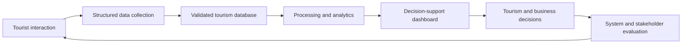
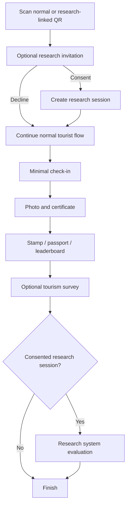
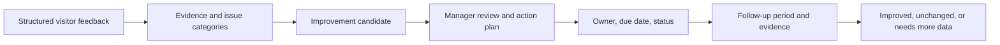

# Research Blueprint: Smart Tourism Data and Decision Support

Status: Technical foundation approved by the project owner; final protocol, instrument activation, and field data collection remain subject to advisor/ethics approval

Version: 0.1

Date: 2026-08-08

System: Southern Border Tourism Data & Intelligence Platform

Implementation note (2026-08-09): The generic, inactive, versioned research infrastructure and production attraction-improvement workflow are implemented for technical review. No final questionnaire/task wording is seeded, no production study is activated, and no field collection may begin until advisor/ethics approval, cognitive pretest, pilot, and version freeze are recorded.

## 1. Executive Decision

The project is strong enough to become an Information Systems research project. It should not be framed as only a website satisfaction study.

The recommended research design is a **Design Science Research pilot with mixed-method evaluation**:

1. Build and evaluate the Smart Tourism information-system artifact.
2. Collect real operational tourism data through the actual QR, visit, certificate, stamp, survey, and dashboard flow.
3. Evaluate system success and technology acceptance with a separate research instrument.
4. Evaluate business decision support through task-based sessions with tourism operators.
5. Keep real field data, simulated usability data, and internal pilot data analytically separate.

This direction matches the project objective:

> Transform structured tourist and visit data into decision-ready information for sustainable tourism planning and local business decisions.

Design Science is appropriate because it evaluates an information-system artifact through building and use, not only opinions about a screen. TAM contributes Perceived Usefulness and Perceived Ease of Use, while the updated DeLone-McLean model contributes System Quality, Information Quality, User Satisfaction, intention to use, and benefits.

## 2. Three Possible Research Scopes

| Option | Scope | Time | Academic strength | Decision |
|---|---|---:|---|---|
| A. Focused Design Science pilot | Real system flow, tourist evaluation, behavioral logs, tourism data, operator decision tasks | 10-12 weeks | Strong and aligned with Business Computer | **Recommended** |
| B. Full explanatory model | All constructs, confirmatory hypotheses, large sample, advanced model testing | 4-6 months or more | Strong if sample and methods are adequate | Defer until sample-size planning is approved |
| C. Usability-only evaluation | Task completion and satisfaction after using the app | 6-8 weeks | Feasible but too narrow for the current platform | Emergency fallback only |

The recommended option is A. It demonstrates the complete chain from data collection to business decision support without making claims that a small pilot sample cannot support.

## 3. Recommended Research Title

Preferred title:

> การพัฒนาและประเมินแพลตฟอร์มสารสนเทศการท่องเที่ยวอัจฉริยะเพื่อรวบรวม วิเคราะห์ และสนับสนุนการตัดสินใจทางธุรกิจ: กรณีศึกษาพื้นที่นำร่องจังหวัดยะลา

Use this narrower variant if every field site is in Mueang Yala district:

> การพัฒนาและประเมินแพลตฟอร์มสารสนเทศการท่องเที่ยวอัจฉริยะเพื่อสนับสนุนการตัดสินใจทางธุรกิจ: กรณีศึกษาอำเภอเมืองยะลา

The geographic wording must match the real recruitment sites. Do not claim province-wide representativeness if participants are recruited only in one district.

## 4. Research Contribution

The contribution is not the use of Next.js, QR codes, or a dashboard by themselves. The contribution is the design and evaluation of an information system that performs this cycle:



The study therefore contributes in four layers:

- **Artifact contribution:** a production-oriented Smart Tourism Web App and analytics platform.
- **Empirical contribution:** tourism behavior, funnel, satisfaction, and system-evaluation evidence from actual use.
- **Business contribution:** evidence about whether dashboard information helps operators identify segments, opportunities, and service-improvement priorities.
- **Attraction-management contribution:** an evidence trail from visitor feedback to improvement priority, responsible action, and follow-up measurement.

## 5. Research Objectives

1. Develop a Smart Tourism information platform that collects and manages tourist, visit, travel behavior, expense, satisfaction, and engagement data in a structured form.
2. Evaluate system quality, information quality, ease of use, usefulness, trust, satisfaction, and intention to reuse the platform.
3. Analyze actual user behavior through session-level funnel completion, drop-off, and elapsed time.
4. Analyze tourism patterns from **real field participants only**, without mixing simulated or internal-test data.
5. Evaluate whether the analytical dashboard supports practical tourism-business and attraction-management decisions.
6. Design a traceable process that helps attraction managers identify, prioritize, act on, and monitor visitor-feedback issues.
7. Establish a privacy-aware, reproducible research dataset and export process.

## 6. Research Questions

- **RQ1:** How do users evaluate the platform's system quality, information quality, ease of use, usefulness, trust, satisfaction, and intention to reuse?
- **RQ2:** At which stages do users complete or leave the QR-to-certificate-to-survey flow, and how long does each stage take?
- **RQ3:** What tourist profile, travel behavior, expense-range, and attraction-satisfaction patterns appear in the real field dataset?
- **RQ4:** Can tourism operators correctly and efficiently use the dashboard to identify customer segments and promotion opportunities?
- **RQ5:** Can attraction managers use visitor feedback to identify, prioritize, and monitor practical site improvements?
- **RQ6:** How are certificate, digital stamp, and leaderboard incentives associated with engagement and self-reported willingness to provide optional data?

## 7. Proposed Hypotheses

These hypotheses are optional until the advisor approves the sample-size and analysis plan. For a small pilot, report them as exploratory associations rather than a confirmed causal model.

- **H1:** System Quality is positively associated with User Satisfaction.
- **H2:** Information Quality is positively associated with Perceived Usefulness.
- **H3:** Perceived Ease of Use is positively associated with Perceived Usefulness.
- **H4:** Perceived Usefulness is positively associated with User Satisfaction.
- **H5:** User Satisfaction is positively associated with Behavioral Intention.
- **H6:** Incentive Engagement is positively associated with willingness to provide optional tourism data. This supports RQ6 as an exploratory association, not a causal claim.

Do not promise Structural Equation Modeling for a target sample of 60-100. The statistical method must follow an advisor-approved power/sample-size calculation and the final data distribution.

## 8. Data Layers and Units of Analysis

### 8.1 Data layers

| Layer | Purpose | Examples | Allowed interpretation |
|---|---|---|---|
| Operational tourism data | Describe tourist and visit behavior | Age group, origin, transport, visit, expense range, satisfaction | Tourism patterns within the collected sample |
| Behavioral system data | Measure actual interaction | Funnel events, completion, drop-off, elapsed time | Observed system behavior, not opinions |
| Research evaluation data | Evaluate the artifact | System quality, usefulness, satisfaction, intention | System evaluation for consented research participants |
| Operator task data | Evaluate decision support | Task success, time, confidence, rationale | Stakeholder evaluation, not population inference |
| Attraction management data | Operate and follow improvement work after evidence review | Issue category, owner, priority, due date, action status, baseline/follow-up period | Production management activity, not a research response |

### 8.2 Units of analysis

These records must never be treated as interchangeable:

- **Tourist:** a profile that may have multiple identities and visits.
- **Visit:** one tourism visit recorded by the operational system.
- **Research session:** one consented participation episode in a defined study and collection mode.
- **Funnel event:** one system event; it is not a unique person.
- **Evaluation response:** one submitted instrument version for one research session.
- **Operator task attempt:** one participant performing one decision-support task.
- **Improvement issue:** one reviewed attraction-and-dimension evidence bundle accepted for management follow-up.
- **Improvement action:** one production work record created from a reviewed issue, with owner, status, due date, and follow-up definition.

Dashboard labels and research exports must state their unit and denominator.

## 9. Participant Groups

### 9.1 Group A: tourists or system users

Target planning range: 60-100 completed participants, subject to the advisor-approved sampling and power plan.

- Real tourists at 2-3 controlled Yala pilot sites should form the primary tourism-analysis sample.
- Students or non-travel participants may be used for usability testing only.
- Simulated participants must never be included in claims about real tourist spending or behavior.
- A participant must be able to decline research while continuing to receive the normal certificate experience.

A sample of 60-100 can be useful for a pilot, descriptive statistics, scale reliability, and carefully labelled exploratory associations. It is not automatically representative of all Yala tourists and does not by itself justify a complex causal model.

### 9.2 Group B: tourism-business and attraction-management stakeholders

Target planning range: 10-15 participants.

This is a task-based stakeholder evaluation with short interviews, not a province-wide operator survey. Suitable participants include accommodation, food, cafe, souvenir, activity, community-tourism, attraction/site managers, local authorities, and tourism-support organizations.

Recruit purposively by role. Where access permits, include at least 3-5 attraction/site-management participants inside the 10-15 stakeholder sessions so that site-improvement usefulness is not inferred only from business owners.

## 10. Research Flow and Consent Boundary

Recommended flow:



Research consent must be separate from operational consent.

- Declining research must not block check-in, certificate, stamp, or public content.
- Research purpose, instrument version, retention, withdrawal, and contact information must be shown before research-specific processing.
- Withdrawing research consent excludes the research session and its linked data from research analysis. Operational records may be retained only under their independently disclosed purpose and lawful basis.
- No pre-consent operational event should be retrospectively treated as research data unless the protocol and consent explicitly allow that linkage.

### 10.1 Whole-journey burden budget

The risk is cumulative participant fatigue, not the 22 evaluation items in isolation. The pilot must measure the whole journey from QR scan to the last optional answer.

| Stage | UX rule | Pilot target |
|---|---|---|
| Minimal check-in | Ask only the data needed to continue | Median completion at or below 60 seconds |
| Photo, certificate, stamp | Deliver visible value before optional questions | Never condition the reward on research completion |
| Tourism survey | Short, skippable, progress visible | Target median at or below 2 minutes |
| Research evaluation | Show expected time, progress, save/retry, and leave option | Target median at or below 4 minutes |
| Combined optional burden | Do not force both optional forms in one uninterrupted session | Review total time and abandonment before freeze |

Research-mode routing may prioritize the research evaluation and offer the tourism survey separately, but the approved protocol must define the order before the pilot. The interface must never pretend that an optional form is required to keep a certificate or stamp.

## 11. Collection Modes

Use controlled values, not free text:

| Value | Meaning | Included in tourism claims? |
|---|---|---|
| `field_observation` | Participant is using the system during a real visit | Yes, subject to inclusion rules |
| `simulated_usability` | Participant follows a scenario without a real trip | No |
| `pilot_internal` | Team, developer, or pretest record | No |

Normal production records that are not part of a research study should have no research session. Research dashboards and exports must require an explicit study and collection-mode filter.

## 12. Tourist Research Instrument

Use a 5-point agreement scale:

```text
1 = ไม่เห็นด้วยอย่างยิ่ง
2 = ไม่เห็นด้วย
3 = ไม่แน่ใจ
4 = เห็นด้วย
5 = เห็นด้วยอย่างยิ่ง
```

The wording below is a draft for expert review and pilot testing. It must be version-locked before field collection.

| Code | Construct | Thai item draft |
|---|---|---|
| SQ1 | System Quality | ระบบตอบสนองได้รวดเร็วเพียงพอต่อการใช้งาน |
| SQ2 | System Quality | ระบบทำงานต่อเนื่องโดยไม่เกิดข้อผิดพลาดที่รบกวนการใช้งาน |
| SQ3 | System Quality | ขั้นตอนตั้งแต่เช็กอินจนได้รับใบประกาศทำงานสอดคล้องกัน |
| IQ1 | Information Quality | ข้อมูลสถานที่ท่องเที่ยวมีความชัดเจนและเข้าใจง่าย |
| IQ2 | Information Quality | ข้อมูลที่นำเสนอเกี่ยวข้องกับสิ่งที่ฉันต้องการทราบ |
| IQ3 | Information Quality | ข้อมูลมีประโยชน์ต่อการวางแผนหรือเลือกสถานที่ท่องเที่ยว |
| PE1 | Perceived Ease of Use | ฉันเรียนรู้วิธีใช้ระบบได้ง่าย |
| PE2 | Perceived Ease of Use | ฉันทำแต่ละขั้นตอนได้โดยไม่สับสน |
| PE3 | Perceived Ease of Use | เมนู ปุ่ม และข้อความบอกสิ่งที่ต้องทำได้ชัดเจน |
| PU1 | Perceived Usefulness | ระบบช่วยลดเวลาในการค้นหาและบันทึกประสบการณ์ท่องเที่ยว |
| PU2 | Perceived Usefulness | ระบบช่วยให้ฉันตัดสินใจเกี่ยวกับการท่องเที่ยวได้ดีขึ้น |
| PU3 | Perceived Usefulness | Digital Passport ช่วยให้ฉันติดตามสถานที่ที่เคยไปได้เป็นประโยชน์ |
| TR1 | Privacy / Trust | ฉันเข้าใจว่าระบบนำข้อมูลที่ขอไปใช้เพื่ออะไร |
| TR2 | Privacy / Trust | ฉันมั่นใจเพียงพอที่จะให้ข้อมูลตามที่ระบบร้องขอ |
| SAT1 | User Satisfaction | โดยรวมฉันพึงพอใจต่อแพลตฟอร์มนี้ |
| SAT2 | User Satisfaction | ประสบการณ์ใช้งานเป็นไปตามที่ฉันคาดหวัง |
| SAT3 | User Satisfaction | การใช้แพลตฟอร์มทำให้ประสบการณ์ท่องเที่ยวของฉันดีขึ้น |
| BI1 | Behavioral Intention | ฉันมีแนวโน้มกลับมาใช้แพลตฟอร์มนี้อีก |
| BI2 | Behavioral Intention | ฉันมีแนวโน้มแนะนำแพลตฟอร์มนี้ให้ผู้อื่น |
| ENG1 | Incentive Engagement | ใบประกาศดิจิทัลทำให้ประสบการณ์ท่องเที่ยวน่าสนใจขึ้น |
| ENG2 | Incentive Engagement | Stamp หรือ Leaderboard กระตุ้นให้ฉันอยากไปสถานที่อื่นต่อ |
| ENG3 | Incentive Engagement | รางวัลในระบบทำให้ฉันเต็มใจตอบข้อมูลเพิ่มเติมที่ไม่บังคับมากขึ้น |

Recommended length: 19 core items plus the 3-item incentive module, one optional comment, and no duplicate demographic questions.

The pilot should verify that the evaluation takes no more than approximately four minutes for most participants. Predefine these product-research review triggers:

- median evaluation time exceeds four minutes;
- fewer than 80% of participants who start the evaluation submit it;
- any item has more than 5% avoidable non-response;
- participant interviews show repeated confusion, redundancy, or fatigue;
- the funnel shows a material new drop-off immediately after opening the evaluation.

These are project pilot gates, not universal statistical laws. If a trigger occurs, shorten or rewrite the instrument **before** version freeze through expert review, construct coverage, item behavior, and participant feedback. Do not remove an item only because deleting it increases a reliability coefficient, and never remove items after final collection merely to improve results.

If an English instrument is used, preserve the same item codes and complete a documented translation review; do not independently rewrite the Thai and English versions during collection.

## 13. Tourism Survey Corrections Before Fieldwork

The current operational survey is valuable, but these issues must be resolved before collecting final data:

1. **Facility score mismatch:** `satisfaction_surveys.facility_score` and dashboard calculations exist, but `MicroSurveyForm` does not ask the question. Add one 1-5 item for facilities, or remove/relabel the metric before fieldwork. The recommended action is to add the item.
2. **Preferred-language bias:** `tourists.preferred_language` is used by analytics, while profile creation can default missing values to `th`. Detect browser/request language, let the participant change it, and record the source. Do not interpret a technical default as a stated preference.
3. **Expense meaning:** spending range is self-reported and must never be labelled as business revenue or official economic impact.
4. **Expense categories:** if multiple categories are needed, add a normalized visit-to-category relation with at most three selections and one primary category. Do not overload the current single-category field.
5. **Instrument freeze:** after pilot corrections, lock survey and evaluation versions. Never change item meaning during the same collection wave.

## 14. Operator and Attraction-Manager Decision-Support Evaluation

The task bank contains five tasks. Each participant completes four tasks selected for their role so business operators are not forced through site-management work that does not match their responsibilities.

| Task | Expected evidence | Measurement |
|---|---|---|
| Identify the primary visitor segment | Age/origin/group/travel pattern supported by dashboard evidence | Correctness, time, confidence |
| Identify one service-improvement priority | High use plus low satisfaction/dimension evidence | Correctness, time, rationale |
| Identify one promotion opportunity | High satisfaction plus low visit volume or under-promoted segment | Correctness, time, rationale |
| Propose one business action | Promotion, staffing, package, inventory, or partnership linked to data | Evidence use, feasibility, confidence |
| Propose one attraction improvement | Select a feedback dimension, show evidence, define an action and follow-up measure | Evidence use, priority logic, measurability |

After the tasks, use 8-10 Thai-first Likert items covering clarity, relevance, decision speed, confidence, usefulness, trust, and intention to use, followed by a short semi-structured interview.

The outcome should be reported as stakeholder task evidence and themes. Compare task evidence by stakeholder role where the group is large enough, but do not generalize percentages to all tourism businesses or attraction managers in Yala.

## 15. Attraction Feedback and Improvement Loop

The platform must answer more than “which attraction scored low?” It should show what needs attention, why it matters, what was done, and whether the indicator changed afterward.



### 15.1 Evidence available to a site manager

- overall satisfaction and the facility, cleanliness, safety, accessibility, information/signage, and value dimensions;
- response count, response coverage, date range, and comparison period;
- visit volume and trend shown separately from survey response volume;
- revisit and recommendation intention;
- privacy-safe comment excerpts grouped into controlled issue categories;
- recurring issue count and recent direction;
- benchmark against the attraction's own previous period, not only a league table against different sites.

### 15.2 Transparent prioritization

Do not begin with an opaque “AI priority score.” Mark an attraction-dimension pair as an improvement candidate only when:

1. the privacy/minimum-response threshold is met;
2. the dimension is below an approved threshold or shows a sustained decline;
3. the issue recurs in structured feedback or coded comments; and
4. visit reach or service impact is meaningful enough to review.

Show every input behind the recommendation. Low response counts must display “ข้อมูลยังไม่เพียงพอ,” not a negative judgment.

### 15.3 Management workflow

The attraction detail in admin should provide:

1. **Feedback overview:** current dimension scores, trends, coverage, and issue categories.
2. **Evidence drill-down:** anonymized responses/comments with date and filter context.
3. **Create improvement action:** issue category, evidence note, proposed action, owner, priority, due date, and baseline period.
4. **Track action:** planned, in progress, completed, verified, or cancelled with an audit trail.
5. **Follow-up:** compare the defined before/after periods with response counts and uncertainty clearly shown.

A before/after change is monitoring evidence, not proof that the action caused the change. Causal evaluation requires a stronger approved design.

### 15.4 Stakeholder value

| Stakeholder | Value received |
|---|---|
| Tourist | Better information, reward, personal travel memory, and visible improvements to the visitor experience |
| Local business | Visitor segments, travel patterns, self-reported spending ranges/categories, demand timing, and promotion opportunities |
| Attraction/site manager | Specific service dimensions and recurring feedback translated into traceable improvement actions |
| Local authority/researcher | Aggregated evidence for planning, prioritization, follow-up, and transparent research analysis |

### 15.5 Decision on AI

Runtime AI is **not required** for this pilot or for the core research contribution.

- Use reproducible SQL/statistical calculations and transparent qualification rules for dashboard insights.
- Use controlled issue categories selected or reviewed by an authorized admin for feedback classification.
- Do not send raw tourist comments, identifiers, or research responses to an external LLM.
- Do not label deterministic recommendations as AI.
- Development assistants may help write or review code and documents, but their output must be verified and disclosed where university policy requires it. They are not a research variable or participant-facing feature.

AI-assisted comment classification or recommendation generation can be studied later only after the non-AI baseline works, with an approved privacy assessment, cost ceiling, human review, accuracy evaluation, and fallback path. Excluding AI now keeps the pilot affordable, explainable, reproducible, and focused on the actual Information Systems contribution.

## 16. Proposed Research Data Model

Create the research layer only after the protocol and instrument receive advisor approval.

### 16.1 Research tables

| Table | Purpose | Important controls |
|---|---|---|
| `research_studies` | Study protocol, owner, scope, status, dates | Immutable study code and approved protocol version |
| `research_instruments` | Tourist/operator instrument versions | Draft, active, retired; one active version per audience/study |
| `research_items` | Versioned item catalog | Stable item code, construct, Thai/English wording, order, reverse-score flag |
| `research_sessions` | One consented participation episode | Study, participant type, collection mode, visit link, status, inclusion flag |
| `research_consents` | Research-specific consent and withdrawal | Session, version, purpose, accepted/withdrawn timestamps |
| `research_responses` | One submitted instrument per session/version | Unique session plus instrument; started/submitted timestamps |
| `research_answers` | Item-level Likert or text answer | Validation by item type and scale range |
| `research_operator_tasks` | Versioned decision tasks | Expected evidence and scoring rule |
| `research_operator_attempts` | Task outcome per operator session | Success, elapsed time, confidence, notes/code |

### 16.2 Production attraction-management tables

These tables are permanent production functions of the tourism platform. They are not research-only data and remain useful after the study ends.

| Table | Purpose | Important controls |
|---|---|---|
| `attraction_feedback_issues` | Reviewed evidence bundle for one attraction and issue category | Evidence period, response count, status, and review provenance |
| `attraction_improvement_actions` | Management response to a reviewed issue | Owner, priority, due date, baseline, status, completion, and audit fields |

Research sessions may measure whether stakeholders can use this production workflow, but task/evaluation answers stay in the research tables and must not be mixed into live improvement evidence.

### 16.3 Relationships

- A research session may link to one operational visit; operator sessions have no visit.
- A visit remains an operational record and must not become a research record merely because it exists.
- Research QR deployment should use a join table between studies and check-in codes rather than reusing the current orphan `checkin_codes.campaign_id` without a real foreign key.
- Funnel correlation should become a typed session relationship. The current JSON `metadata.session_id` is useful operationally but insufficient as the sole research key.
- Research exports use a study participant code, never raw tourist identity-provider values.
- Feedback issues reference aggregated evidence and controlled categories; they must not copy direct tourist identities into management records.
- Improvement actions reference a reviewed issue and preserve the baseline/follow-up periods used for interpretation.

## 17. Research Analytics

Create a separate `/admin/research` workspace instead of mixing research controls into the operational tourism dashboard.

Recommended views:

1. **Study readiness:** active protocol/instrument/consent versions, sites, and collection dates.
2. **Recruitment and data quality:** invited, consented, completed, withdrawn, excluded, duplicate/incomplete records.
3. **Participant funnel:** session-level stage completion, conversion, drop-off, and median elapsed time.
4. **System evaluation:** item distributions, construct scores, missingness, reliability, and group comparisons.
5. **Tourism patterns:** real-field participants only; profile, behavior, spending range, and satisfaction.
6. **Incentive outcomes:** certificate/stamp/leaderboard interaction and optional-data completion.
7. **Operator decision support:** task success, time, confidence, and coded themes.
8. **Attraction improvement:** issue dimensions, evidence coverage, action status, due work, and follow-up comparisons.
9. **Export readiness:** de-identification status, exclusions, instrument version, and reproducibility metadata.

Every metric must display its denominator, collection mode, study version, and date range. Small groups should be suppressed according to the existing privacy policy, and no chart should imply causation from a descriptive association.

## 18. Analysis Plan

| Dataset | Primary analysis |
|---|---|
| Operational tourism data | Frequency, percentage, median/range, cross-tab, attraction-level comparison |
| Funnel data | Unique-session conversion, drop-off, median elapsed time, device/language breakdown where privacy-safe |
| Evaluation items | Distribution, mean/SD or median/IQR, missingness, construct score |
| Construct scales | Internal consistency using advisor-approved reliability measures; inspect item behavior before aggregation |
| Construct relationships | Pearson or Spearman correlation according to assumptions; limited regression only if sample size and diagnostics permit |
| Operator tasks | Task success, completion time, confidence, evidence quality, thematic coding of interviews |
| Attraction improvements | Issue frequency, dimension trend, action status, before/after descriptive comparison with denominators |

Do not:

- combine simulated and field records;
- call self-reported spending revenue;
- count events as unique people;
- replace missing scores with zero;
- perform SEM only because software is available;
- report causal conclusions from a cross-sectional pilot;
- change the instrument after final field collection starts.

## 19. Threats to Validity and Required Reporting

The final report must disclose these limitations instead of hiding them:

- **Convenience/site sampling:** participants from selected Yala sites may not represent all tourists in Yala or the southern border region.
- **Self-selection:** people willing to scan a QR and finish the reward flow may be more digitally confident or more engaged than non-participants.
- **Completion bias:** evaluation responses come from participants who reach the end of the flow; non-completers may have had a worse experience.
- **Reward halo effect:** receiving a certificate or stamp immediately before evaluation may temporarily increase satisfaction ratings.
- **Common-method bias:** most evaluation constructs use the same self-report instrument at one point in time.
- **Identity uncertainty:** anonymous-device identities reduce friction but cannot guarantee that every profile represents a unique natural person across devices.
- **Small operator group:** operator findings are task-based stakeholder evidence, not province-wide statistical estimates.
- **Cross-sectional design:** associations do not establish causation without an approved experimental or longitudinal design.

Mitigations include reporting recruitment and completion funnels, comparing completers with privacy-safe available non-completer characteristics, using behavioral logs alongside self-report, keeping reward receipt independent of research participation, and documenting exact inclusion/exclusion rules.

## 20. Quality, Ethics, and Privacy Gates

Before final collection:

- advisor approves the title, scope, objectives, RQs, participant groups, and analysis plan;
- institutional ethics/research approval requirements are confirmed;
- research notice and consent are separate from service consent;
- expert review is completed and revisions are recorded;
- a small cognitive/usability pretest confirms participants understand each item;
- pilot records are tagged and excluded from final analysis;
- instrument and consent versions are frozen;
- withdrawal, retention, deletion/exclusion, and incident procedures are documented;
- de-identified export is tested against re-identification and small-group leakage;
- raw names, identity-provider IDs, photos, and signed storage URLs are excluded from the research dataset unless explicitly approved and necessary.

The privacy design follows purpose limitation and data minimization: a new, unrelated research purpose needs its own lawful basis/consent decision, and shared/exported data should be minimized, anonymized, or pseudonymized where appropriate.

## 21. Repository Gap Analysis

| Area | Current evidence | Required action |
|---|---|---|
| Minimal profile | `components/checkin/MinimalForm.tsx` | Add language detection/editability only after field definition is approved |
| Tourist profile | `lib/repositories/tourist.repository.ts` defaults missing language to `th` | Remove measurement bias and record language provenance |
| Tourism survey | `components/survey/MicroSurveyForm.tsx` | Add facility item and preserve optional, low-friction UX |
| Survey validation | `lib/validation/survey.ts` lacks facility input | Add typed validation and version-aware mapping |
| Survey transaction | `20260713000000_atomic_survey_submission.sql` | Extend only through a new migration; preserve atomicity |
| Funnel | `lib/repositories/funnel.repository.ts` stores session ID in JSON metadata | Add research-session correlation and session-level metrics |
| Check-in campaign | `checkin_codes.campaign_id` is a placeholder without a campaign table | Use a real research-study/check-in relation and foreign keys |
| Consent | `consent_records` supports purpose/version for operational users | Keep research consent separately auditable, including operators and withdrawal |
| Dashboard | Operational analytics already exists | Add separate research workspace and avoid changing operational definitions |
| Attraction feedback | Scores/comments exist but are not a complete action-management loop | Add transparent evidence, issue review, action ownership, and follow-up workflow |
| Export | Admin exports already exist | Add study-scoped, de-identified, versioned research export |

## 22. Acceptance Criteria Before Data Collection

- A research session cannot be created without an active study and consent version.
- Declining research does not block the product flow.
- Every research response references exactly one session and one immutable instrument version.
- Real field, simulated usability, and internal pilot data can be filtered and cannot be accidentally merged in default reports.
- Funnel metrics count unique research sessions and show denominators.
- Operational tourism survey includes a facility decision that matches the schema/dashboard.
- Preferred language is observed or selected, not silently assumed to be a participant preference.
- Operator tasks have fixed instructions and scoring rules.
- Pilot evaluation completion time and abandonment are reviewed before version freeze.
- Pilot reduction rules are applied before freeze when burden triggers are exceeded.
- Attraction recommendations show evidence, response count, period, and issue dimension instead of an unexplained score.
- Site managers can create and follow an improvement action without viewing tourist identity.
- Research export excludes direct identity, raw photos, private paths, and small-group disclosures.
- A pilot-to-final reset/exclusion procedure is documented and tested.

## 23. Timeline and Feasibility

### Recommended 12-week plan

| Weeks | Deliverable |
|---|---|
| 1-2 | Final title, scope, RQs, conceptual model, sample plan, ethics/consent requirements |
| 3 | Expert review, item revision, operator-task protocol, data dictionary |
| 4-6 | Research schema, consent/session flow, evaluation UI, admin research workspace, export |
| 7 | Automated tests, accessibility/privacy review, pilot deployment |
| 8 | Cognitive pretest and pilot; fix defects; freeze instrument versions |
| 9-10 | Real field collection and operator sessions |
| 11 | Data cleaning, reliability, descriptive/exploratory analysis, qualitative coding |
| 12 | Results, limitations, chapter/report drafts, reproducibility package |

### Eight-week compressed plan

Two months is possible only as a tightly scoped pilot:

- use 2-3 Yala sites;
- keep the tourist instrument to the approved 19 core items plus a small incentive module;
- use descriptive, reliability, funnel, and exploratory association analysis;
- treat operator work as task-based stakeholder evaluation;
- freeze scope after week 2;
- collect no final data until consent, versioning, and mode separation pass QA.

The eight-week plan has almost no recovery time for advisor revisions, ethics approval, recruitment delays, or production defects.

### Feasibility conclusion

- **Three months:** realistic and recommended for a defensible pilot study if advisor/ethics decisions happen in the first two weeks.
- **Two months:** possible for a pilot, but risky and unsuitable for a broad representative or complex causal study.
- **Code implementation alone:** approximately 4-6 weeks for a three-person team after adding research controls and the attraction-improvement workflow.
- **Research completion:** requires the remaining time for pretest, field collection, cleaning, analysis, and writing. Software completion is not the same as research completion.
- **Improvement outcome evidence:** three months is enough to create actions and evaluate whether managers can use the workflow. It may not be long enough to prove that completed actions produced durable changes in visitor outcomes; that requires a longer follow-up period.

## 24. Decision Gates

No research code or final data collection should begin until the advisor approves:

1. final geographic scope and title;
2. participant groups and recruitment method;
3. whether hypotheses are confirmatory or exploratory;
4. sample-size/power method;
5. final tourist and operator instruments;
6. research consent, withdrawal, and retention procedure;
7. analysis and exclusion rules.

After approval, `tasks/PHASE_18_RESEARCH_EVALUATION_LAYER.md` becomes the implementation authority.

## 25. Academic Foundations

- Davis, F. D. (1989). [Perceived Usefulness, Perceived Ease of Use, and User Acceptance of Information Technology](https://aisel.aisnet.org/misq/vol13/iss3/6/). MIS Quarterly, 13(3).
- DeLone, W. H., & McLean, E. R. (2003). [The DeLone and McLean Model of Information Systems Success: A Ten-Year Update](https://doi.org/10.1080/07421222.2003.11045748). Journal of Management Information Systems, 19(4), 9-30.
- Hevner, A. R., March, S. T., Park, J., & Ram, S. (2004). [Design Science in Information Systems Research](https://aisel.aisnet.org/misq/vol28/iss1/6/). MIS Quarterly, 28(1).
- Office of the Personal Data Protection Committee. [GPPC Privacy Policy](https://gppc.pdpc.or.th/privacy-policy/): purpose limitation, data-subject rights, retention, data minimization, anonymization, and pseudonymization guidance reflected in this blueprint.
